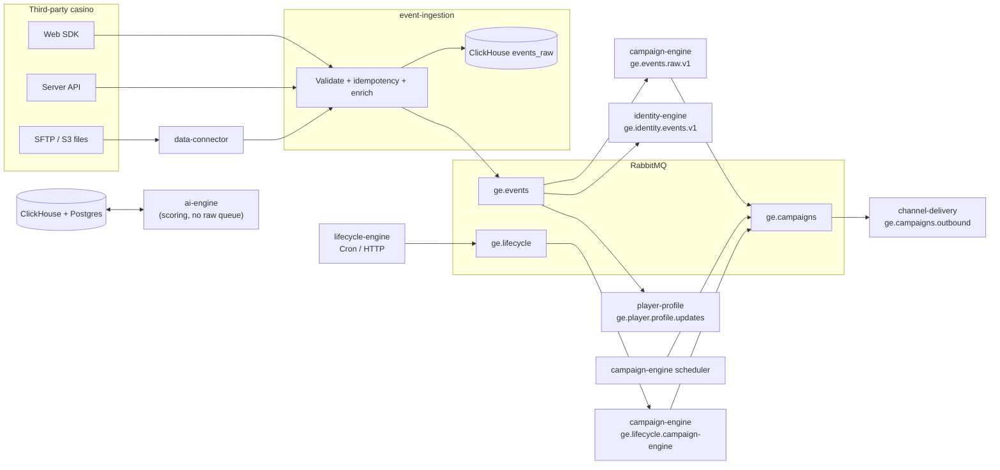

# Event flow, casino integration, and service responsibilities

This document explains how **third-party casinos** send data into GammaEngage, how **events move through the platform**, which **queues and exchanges** are involved, and **what each backend service does** when events are consumed. It complements the operator-facing [casino-integration-guide.md](./casino-integration-guide.md) with an engineering view grounded in this repository.

---

## 1. How casinos integrate (three surfaces)

Casinos are identified by **`brand_id`** (tenant). They do not talk to every service directly; they integrate with **event-ingestion** (and optionally **data-connector** for files) using API keys and the shared **event envelope** contract from `@gammaengage/shared`.

| Surface | Purpose | Typical caller |
|--------|---------|----------------|
| **Web SDK** | Browser-side tracking (page visits, `login`, custom events) | Casino front-end |
| **Server API** | Authoritative backend events (`deposit`, `bet_placed`, etc.) | Casino backend → `POST /events` or batch on **event-ingestion** |
| **Batch files (SFTP / S3)** | Historical or bulk customers, transactions, games, or pre-shaped events | **data-connector** polls buckets, parses CSV/JSON, POSTs to **event-ingestion** import routes |

**data-connector** maps file types to ingestion endpoints (`/imports/customers`, `/imports/transactions`, `/imports/games-daily`, `/imports/ootb-events`) and uses `INTERNAL_API_KEY` when calling **event-ingestion** — see `RecordProcessorService`.

**Authentication on the public ingest API:** requests use **`X-API-Key`** (and related guards such as HMAC where configured). Rate limiting is **per `brand_id`** in Redis.

---

## 2. Ingestion: what happens before the queue

All validated paths converge on **event-ingestion**’s `EventsService.ingestEvent`:

1. **Validate** the body as an `EventEnvelope` (`validateEventEnvelope`).
2. **Idempotency** via Redis (`idempotency_key` + `brand_id`) — duplicates raise `DuplicateEventError` / HTTP 409 on single-event ingest.
3. **Optional enrichment** — e.g. game metadata from **game-catalog** when `game_id` appears in the payload.
4. **Parallel fan-out** (none of these blocks the others for correctness):
   - Publish the full envelope to RabbitMQ (**raw events** routing).
   - Publish a **profile update** message (derived fields) on a separate routing key for **player-profile**.
   - **Append-only insert** into ClickHouse (`ClickHouseService.insertEvent`) for analytics and operational queries (e.g. integration health).

So: **event-ingestion** is the single write boundary for “accepted events”; **RabbitMQ** distributes work to consumers; **ClickHouse** stores the raw stream for analytics.

---

## 3. RabbitMQ topology (conceptual)

Defaults are defined in shared config (`RABBITMQ_EXCHANGE`, `RABBITMQ_QUEUE_RAW`, `RABBITMQ_ROUTING_KEY_RAW`):

| Exchange | Routing keys (examples) | Role |
|----------|-------------------------|------|
| **`ge.events`** (topic) | `events.raw.v1` | Raw player events after ingestion |
| | `player.profile.updates` | Denormalized hints for profile upserts |
| **`ge.campaigns`** (topic) | `campaigns.outbound.v1` | Matched campaigns ready for delivery |
| **`ge.lifecycle`** (topic) | `lifecycle.stage.transitioned` | Lifecycle stage changes from **lifecycle-engine** |

**Queues** (non-exhaustive; see code for DLQ/retry naming):

- `ge.events.raw.v1` — **campaign-engine** event consumer.
- `ge.identity.events.v1` — **identity-engine** (same exchange binding pattern for raw events).
- `ge.player.profile.updates` — **player-profile**.
- `ge.campaigns.outbound` — **channel-delivery**.
- `ge.lifecycle.campaign-engine` — **campaign-engine** lifecycle consumer.

Messages are **persistent**; consumers use **prefetch**, **ack/nack**, and shared **retry / DLQ** helpers (`assertQueueWithDlq`, `republishToRetryOrDlq`).

---

## 4. End-to-end diagram (high level)

**ai-engine** is drawn with a **read/write loop** to ClickHouse and Postgres (see §6); it does not subscribe to `ge.events`.

---

## 5. How each consumer uses events

### 5.1 campaign-engine — `ge.events.raw.v1` (`EventConsumerService`)

For each message:

1. Parse and **validate** `EventEnvelope`.
2. **Player state** — `PlayerStateService.updateFromEvent` (in-memory / persisted state used for triggers).
3. **Snapshot** — optional upsert for reporting (`SnapshotService`; failures are non-fatal).
4. **Conversions** — `ConversionTrackerService.checkConversion` (attribution / funnel logic).
5. **Journeys** — `JourneyService.enrollFromEvent` when configured.
6. **Triggers** — `TriggerEvaluatorService.evaluate` against campaigns and state.
7. For each match, **publish** to **`ge.campaigns`** → queue `ge.campaigns.outbound` (`CampaignPublisherService`).

So raw casino events drive **real-time** automation: segments, journeys, and campaign triggers.

### 5.2 identity-engine — `ge.identity.events.v1`

Binds to **`ge.events`** with **`events.raw.v1`**. It **does not** replace campaign logic; it builds an **identity graph** when multiple signals co-occur (e.g. `visitor_id` + `external_player_id`, hashed email, device). Some event types are skipped (`shouldSkipIdentityResolutionByType`). Requires at least **two** identity signals to create edges.

### 5.3 player-profile — `ge.player.profile.updates`

Consumes **derived** profile update messages (published alongside raw events from **event-ingestion**). Updates **contact, consent, balances**, etc., for use by **channel-delivery** (e.g. email address, opt-outs) and admin UIs.

### 5.4 channel-delivery — `ge.campaigns.outbound` (`CampaignConsumerService`)

Consumes **campaign outbound** payloads (`CampaignOutboundMessage`): template rendering, **throttling**, channel dispatch (email, SMS, push, WhatsApp, web push, webhooks, etc.), optional **waterfall** mode, forwards **`campaign.dispatched`**-style telemetry to ClickHouse, and notifies **outbound webhooks**.

### 5.5 lifecycle-engine (producer, not raw-event consumer)

**lifecycle-engine** does **not** consume `ge.events.raw.v1` in the same way. It:

- Runs **scheduled** jobs (e.g. daily cron) and can **evaluate a single player** via HTTP (`evaluatePlayer`).
- Reads **player profile** data and **ClickHouse** activity aggregates to compute **lifecycle stage** and transitions.
- Publishes **`lifecycle.stage.transitioned`** on **`ge.lifecycle`**.

### 5.6 campaign-engine — lifecycle consumer (`LifecycleConsumerService`)

Listens on **`ge.lifecycle`** / `ge.lifecycle.campaign-engine`. Maps **`campaign_action`** (e.g. `winback`, `vip_welcome`) to **trigger tags** and queues sends via the same outbound campaign path — so lifecycle transitions trigger **pre-configured** campaigns without a new raw event from the casino.

---

## 6. ai-engine — scoring, batch jobs, and training

**ai-engine** is a **Python (FastAPI)** service. It does **not** consume `ge.events.raw.v1`. Instead it turns **stored** casino activity into **risk and value scores** and **next-best-action (NBA)** recommendations by reading the same data planes the pipeline already maintains: primarily **ClickHouse** (event history / aggregates for features) and **PostgreSQL** (`player_profiles` for identity, consent flags, and **persisted scores**).

### 6.1 Runtime scoring (`NbaEngine`)

On each score request or batch job:

1. **Feature extraction** — `extract_features` / `extract_features_batch` load player-centric features from ClickHouse (and related sources) in line with the training pipeline’s semantics.
2. **Three models** — **churn**, **VIP**, and **RG (responsible gambling) risk** (`churn_model`, `vip_model`, `rg_risk_model`). Insufficient history can trigger **RFM-style fallbacks** for churn/VIP; RG still runs.
3. **NBA policy** — `rank_actions` applies business rules (including RG thresholds) to produce ranked actions.

Exposed HTTP routes (protected with **`X-API-Key`** where configured):

| Route | Purpose |
|-------|---------|
| `POST /score/player` | Single-player score (latency-sensitive path) |
| `GET /score/player/{brand_id}/{player_id}` | Same as above for simple lookups |
| `POST /score/batch` | Up to many players; failures isolated per row |
| `GET /health` | Liveness / readiness |
| `POST /admin/reload-models` | Hot-reload `.joblib` models from disk (`X-Internal-Key`); does not block the event loop |

Prometheus metrics are mounted at `/metrics`.

### 6.2 Scheduled batch scoring (link to lifecycle and campaigns)

An **APScheduler** job (`batch_scorer`, cron from settings, default **every few hours**) walks **`player_profiles`** in pages, scores players in bulk (with **batched ClickHouse** queries where possible), then **writes back** to Postgres:

- `churn_score`, `vip_score`, `rg_risk_score`, `nba_action`, `scores_updated_at`

Those fields are what **lifecycle-engine** (and operator dashboards) use when they read **player profile** rows together with ClickHouse activity — so casino events **indirectly** drive AI outputs: **ingestion → ClickHouse (+ profile updates) → batch scorer → profile scores → lifecycle evaluation**.

RG alerts can be emitted via the **notifier** hook during batch runs (replace with real channels in production).

### 6.3 Training (offline; not in the hot request path)

Training is **offline** and does not use RabbitMQ:

| Script | Role |
|--------|------|
| **`scripts/train_from_db.py`** | Pulls historical events from **ClickHouse**, uses **time-travel** feature windows and future labels so training matches **feature_extractor** semantics at score time. |
| **`scripts/train_from_casino_data.py`** | Trains from **external real casino-shaped datasets** (e.g. Kaggle / Mendeley); preferred over older e-commerce proxy data — see `services/ai-engine/scripts/README.md`. |
| **`scripts/train_from_kaggle.py`** | Legacy e-commerce proxy (documented as biased vs production iGaming). |

Artifacts are **LightGBM** (and related) **`.joblib`** files under the configured **`MODEL_DIR`**. After deploy, **`POST /admin/reload-models`** can load new weights without restarting the process.

### 6.4 How this fits the event diagram

- **Casinos** still send data only through **event-ingestion** (and files via **data-connector**).
- **ai-engine** **never** replaces that path; it **reads** the resulting warehouse state and **updates scores** for automation and reporting.
- For a **mental model**: raw events → **campaign/identity/profile** via RabbitMQ; **parallel** **analytics + ML** via ClickHouse/Postgres and **ai-engine** batch/API.

---

## 7. Supporting services (not queue consumers for raw events)

| Service | Role relative to events |
|---------|-------------------------|
| **game-catalog** | Referenced during ingestion **enrichment** (game metadata by `game_id`). |
| **tenant-admin** | Brand/tenant admin; **integration health** aggregates ClickHouse + data-connector + API key usage (`GET /brands/:id/health`). |
| **admin-auth** | Admin authentication (separate from casino ingest keys). |
| **ai-engine** | See **§6** — scoring and training; uses ClickHouse + Postgres, not `ge.events.raw.v1`. |

---

## 8. Observability and health

- **ClickHouse** `events_raw` (and related tables) backs **last event time**, **24h counts**, and integration dashboards — see [integration-health-contract.md](./integration-health-contract.md).
- **Synthetic tests** can post `integration_health_test` events through ingestion and poll for correlation IDs in ClickHouse.
- **DLQ / retries** apply per consumer queue; **tenant-admin** can surface DLQ-oriented alerts depending on configuration.

---

## 9. Related documents

| Document | Content |
|----------|---------|
| [casino-integration-guide.md](./casino-integration-guide.md) | Non-technical integration steps, event type cheat sheet, channels |
| [integration-health-contract.md](./integration-health-contract.md) | Health API contract and aggregation rules |
| [integration-health-runbook.md](./integration-health-runbook.md) | Operator troubleshooting |
| [README.md](../README.md) | Monorepo layout, env vars, quick start |
| [services/ai-engine/scripts/README.md](../services/ai-engine/scripts/README.md) | Casino vs proxy datasets, `train_from_casino_data.py` options |

---

## 10. Summary

1. **Casinos** send events via **SDK**, **HTTP API**, or **files** processed by **data-connector** — all normalized through **event-ingestion**.
2. **event-ingestion** validates, deduplicates, enriches, writes **ClickHouse**, and publishes to **`ge.events`** (raw + profile updates).
3. **campaign-engine** consumes raw events to update state, evaluate triggers, and publish **outbound campaigns** to **`ge.campaigns`**.
4. **channel-delivery** sends messages to players and records dispatch / webhooks.
5. **identity-engine** and **player-profile** maintain **identity graph** and **player records** in parallel.
6. **lifecycle-engine** evaluates stages on a schedule (and on-demand), publishing **lifecycle** events that **campaign-engine** turns into tagged campaigns.
7. **ai-engine** scores players from **ClickHouse + Postgres** (API and scheduled batch), persists **churn / VIP / RG / NBA** fields on **`player_profiles`**, and retrains models offline from **ClickHouse** or external casino datasets — **without** consuming the raw-events queue.

For exact queue names, routing keys, and class names, search the repo for the constants quoted above (e.g. `ge.events.raw.v1`, `CampaignOutboundMessage`).
