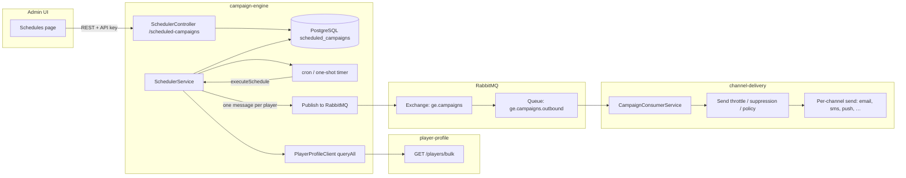
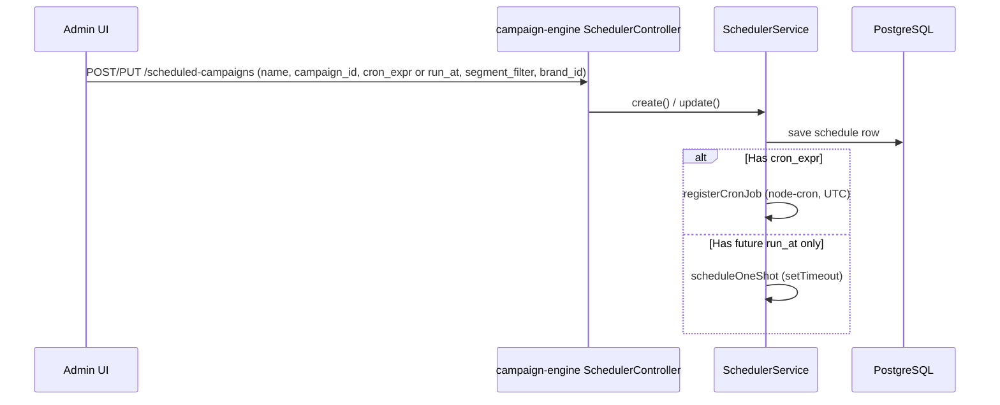
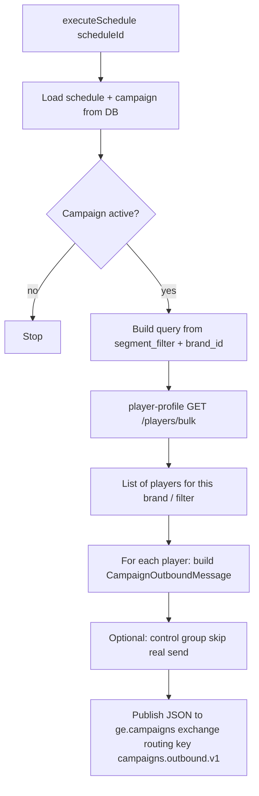
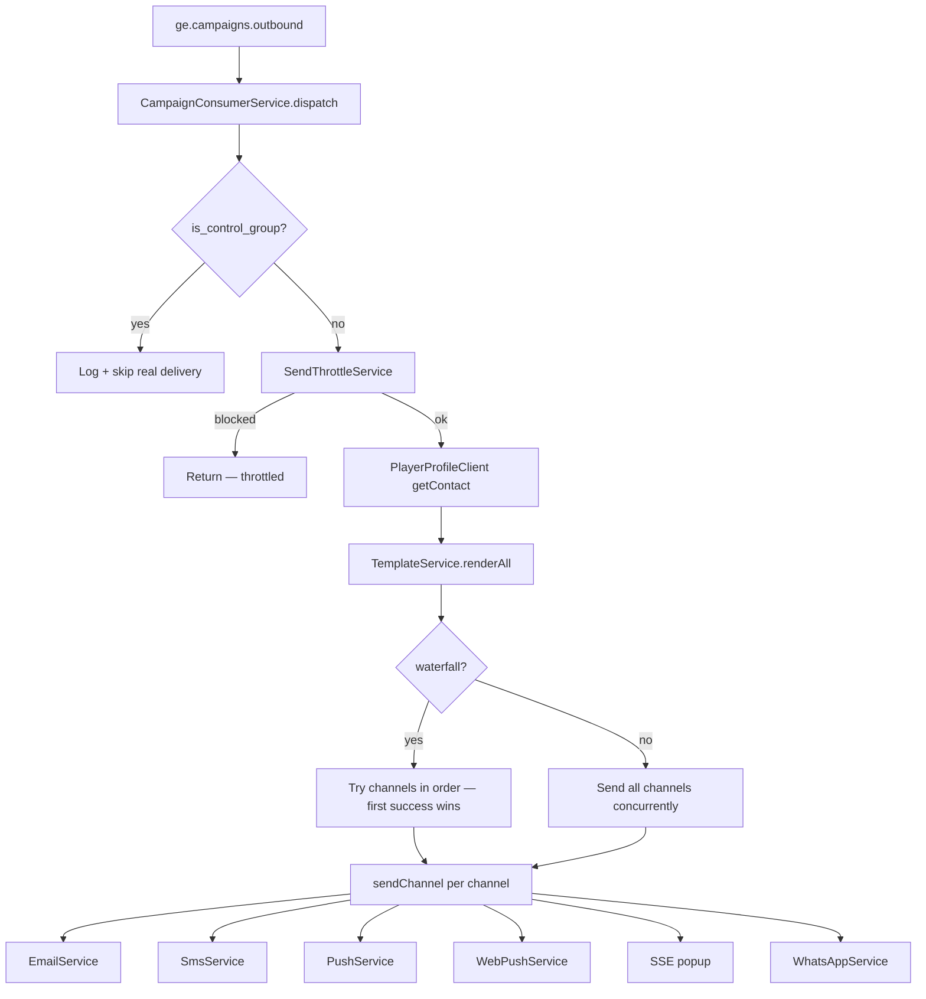
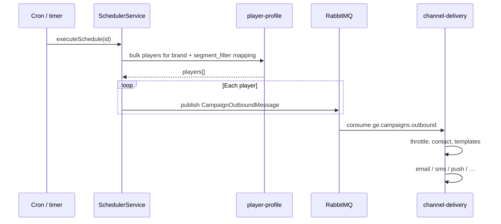

# Scheduled campaign flow (create → send)

This document describes how a **scheduled campaign** moves from the admin UI through **campaign-engine**, **player-profile**, **RabbitMQ**, and **channel-delivery** to reach players on **email, SMS, push, web push, popup, WhatsApp**, etc.

---

## High-level picture

---

## 1. Create / update schedule (admin → API → DB → in-memory jobs)

**Notes:**

- On **process startup**, `reloadAllCronJobs()` loads **active** rows and registers cron or one-shot jobs again (in-memory `Map`, not Redis).
- **Campaign** is chosen by `campaign_id`; the schedule row does not duplicate channel copy — **channels come from the campaign** when dispatching.

---

## 2. When the job fires: who receives the send?

**Recipient selection (today):**

- `segment_filter` on the schedule is mapped in code to **`brand_id`** plus optional **`allow_email` / `allow_sms` / `allow_push`** flags passed to player-profile bulk query.
- **Empty `{}`** means “no extra flags from the schedule” — bulk query is still scoped by **`brand_id`**; exact semantics of “all players” vs filters are implemented in **player-profile**.
- **Campaign** supplies **`channels`** (comma-separated on the campaign entity → array in the message), **template fields** (email HTML, SMS body, push text, etc.), **control_group_pct**, **waterfall** flag.

---

## 3. RabbitMQ handoff

| Piece | Value |
|--------|--------|
| Exchange | `ge.campaigns` (topic) |
| Routing key | `campaigns.outbound.v1` |
| Queue | `ge.campaigns.outbound` (bound to that routing key) |

Each published payload is one **player** × one **campaign outbound** job (bulk scheduling loops and publishes many messages).

---

## 4. channel-delivery: queue → channels

**Per-channel behavior (simplified):**

- **email** — needs contact email, `allow_email`, HTML rendered + tracking + unsubscribe link → `EmailService.send`.
- **sms** — phone + `allow_sms` → `SmsService.send`.
- **push** — device tokens + `allow_push` → `PushService.send` (per token).
- **web_push** — subscriptions from registry → `WebPushService.send`.
- **popup** — `popup_html` → SSE bus to connected clients.
- **whatsapp** — phone → `WhatsAppService.send`.

Before sending, **channel-delivery** applies **suppression**, **contact policy / frequency caps**, and **send throttle** (daily cap, quiet hours). Failures can trigger **retry** / DLQ patterns via shared Rabbit helpers.

---

## 5. End-to-end (compact sequence)

---

## Related files (for developers)

| Area | Location |
|------|-----------|
| Schedule CRUD + cron registration | `services/campaign-engine/src/scheduler/scheduler.service.ts` |
| HTTP API | `services/campaign-engine/src/scheduler/scheduler.controller.ts` |
| Entity | `services/campaign-engine/src/scheduler/scheduled-campaign.entity.ts` |
| Player bulk HTTP client | `services/campaign-engine/src/scheduler/player-profile.client.ts` |
| Queue consumer + channel switch | `services/channel-delivery/src/consumer/campaign-consumer.service.ts` |
| Admin schedule UI | `admin-ui/src/pages/schedules/` |

---

*Generated for the GammaEngage repo; behavior follows code as of the doc date — verify `segment_filter` mapping and player-profile bulk API if you extend targeting.*
