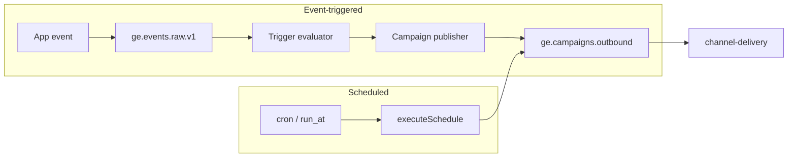
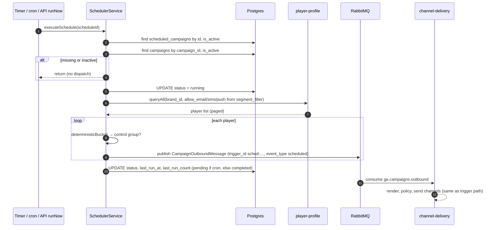

# Scheduled campaigns — how they work

**Scheduled campaigns** send a **campaign** to many **players** on a **timer** (cron or one-shot `run_at`). They **do not** go through the real-time **event** pipeline (`ge.events.raw.v1`) or **trigger evaluation**. The **campaign-engine** `SchedulerService` loads a row from **`scheduled_campaigns`**, resolves recipients via **player-profile**, and **publishes** one outbound message per player to the **same** RabbitMQ path used for trigger-based sends (`ge.campaigns` → `ge.campaigns.outbound`), where **channel-delivery** picks them up.

Implementation: `services/campaign-engine/src/scheduler/scheduler.service.ts`, entity `scheduled-campaign.entity.ts`, HTTP API `scheduled-campaigns` on `SchedulerController`.

---

## Concepts

| Piece | Role |
|--------|------|
| **`scheduled_campaigns` (Postgres)** | Stores `brand_id`, `campaign_id`, `name`, `segment_filter`, either **`cron_expr`** or **`run_at`**, `status`, `is_active`, run metadata. |
| **Schedule types** | **`cron_expr`** — repeating job (UTC). **`run_at`** — single future datetime. If both exist, **cron wins** on registration. |
| **Campaign row** | Loaded by `campaign_id`; must be **active**. Channels, templates, `waterfall`, `control_group_pct` come from **`campaigns`**. |
| **Recipients** | `PlayerProfileClient.queryAll` calls the **player-profile** bulk API with `brand_id` and, today, channel flags read from `segment_filter`: **`allow_email`**, **`allow_sms`**, **`allow_push`** (see `dispatchToPlayers` in `scheduler.service.ts`). |
| **Outbound message** | Same JSON shape as trigger-driven sends: `trigger_id` is synthetic: **`sched:{scheduleId}`**, `event_type` is **`scheduled`**. |
| **Control group** | Same deterministic hash as other sends: fraction of players get `is_control_group: true` and no real delivery (channel-delivery still consumes the message). |

---

## Hierarchical diagram

```mermaid
graph TD
  ROOT((Scheduled campaign))

  ROOT --> DEF([Definition & storage])
  ROOT --> TIM([When it runs])
  ROOT --> RUN([Execution])
  ROOT --> OUT([Outbound path])

  DEF --> D1[Postgres — scheduled_campaigns row]
  DEF --> D2[Postgres — campaigns row linked by campaign_id]
  DEF --> D3[segment_filter JSON — channel flags + profile query]

  TIM --> T1[Startup — reload active schedules]
  TIM --> T2[Cron — cron_expr UTC repeating]
  TIM --> T3[One-shot — setTimeout until run_at]
  TIM --> T4[Manual — POST runNow / executeSchedule]

  RUN --> R1[Load schedule + campaign · check is_active]
  RUN --> R2[status → running]
  RUN --> R3[player-profile — queryAll players for brand + filter]
  RUN --> R4[Per player — control group bucket]
  RUN --> R5[Publish JSON per player to RabbitMQ]
  RUN --> R6[status → pending cron or completed one-shot · last_run_*]

  OUT --> O1[Exchange ge.campaigns]
  OUT --> O2[Routing key campaigns.outbound.v1]
  OUT --> O3[Queue ge.campaigns.outbound]
  OUT --> O4[channel-delivery — same as event-driven campaigns]

  classDef rootStyle fill:#b8d4e8,stroke:#2c5282,stroke-width:2px,color:#1a202c
  classDef cat fill:#e3f2fd,stroke:#1565c0,stroke-width:1px,color:#0d47a1
  classDef leaf fill:#fafafa,stroke:#616161,stroke-width:1px,color:#212121

  class ROOT rootStyle
  class DEF,TIM,RUN,OUT cat
  class D1,D2,D3,T1,T2,T3,T4,R1,R2,R3,R4,R5,R6,O1,O2,O3,O4 leaf
```

### Comparison to event-triggered flow

Scheduled runs **skip** `ge.events.raw.v1` and **trigger evaluation**; they **only** attach at **bulk publish** to `ge.campaigns.outbound`.

---

## Sequential diagram (one run)

---

## Status lifecycle (typical)

| After step | `cron_expr` schedule | `run_at` one-shot |
|------------|----------------------|-------------------|
| Success | `pending` (runs again on next cron tick) | `completed` |
| Failure | `failed` | `failed` |
| While working | `running` (briefly) | `running` (briefly) |

---

## API surface (reference)

| Method | Path | Purpose |
|--------|------|---------|
| POST | `/scheduled-campaigns` | Create schedule; registers cron or one-shot immediately |
| GET | `/scheduled-campaigns?brand_id=` | List |
| PATCH | `/scheduled-campaigns/:id` | Update; re-registers job if cron/run_at/active changed |
| DELETE | `/scheduled-campaigns/:id` | Remove schedule and stop job |
| POST | `/scheduled-campaigns/:id/run` | `runNow` — execute once |

---

## See also

- [trigger-flow-hierarchical.md](./trigger-flow-hierarchical.md) — event → trigger → campaign → channel delivery (real-time path)
- [trigger-explanation.md](./trigger-explanation.md) — full pipeline and storage details
