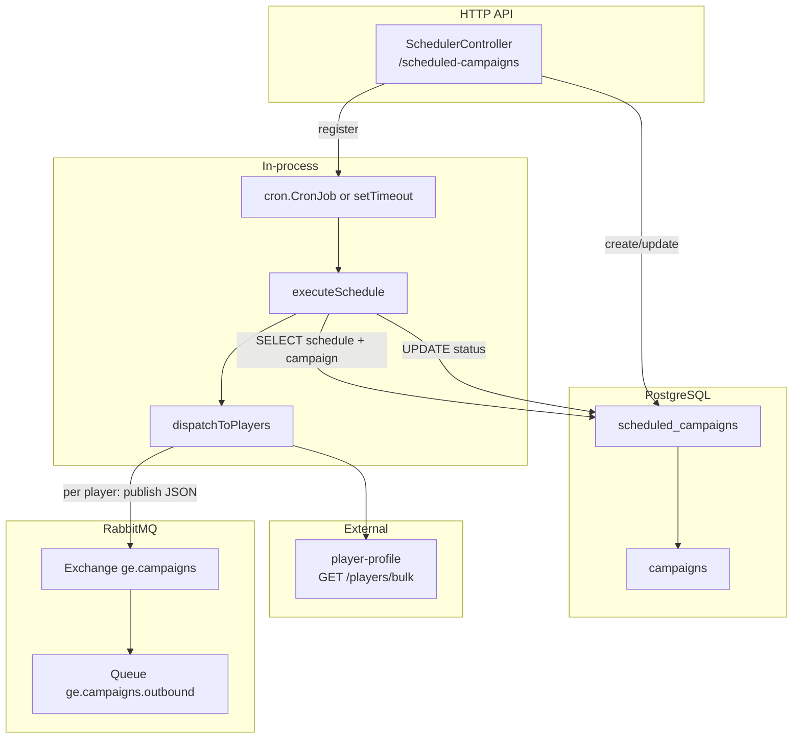
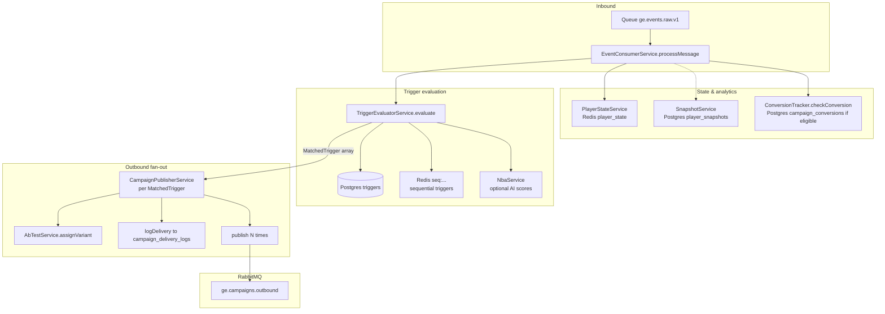
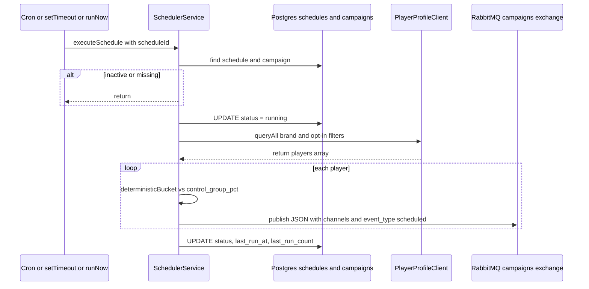
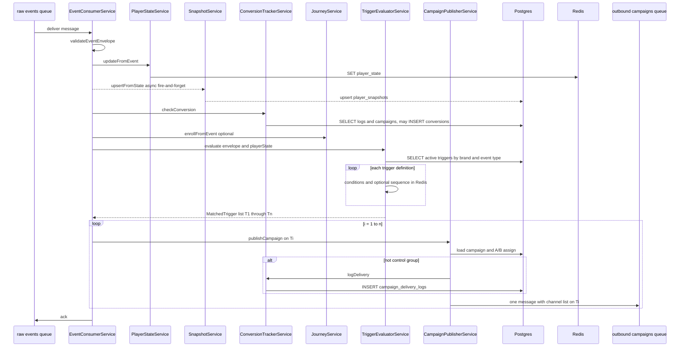
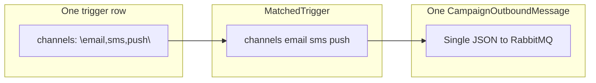

# Scheduled campaigns and outbound flow

This document explains how **scheduled (bulk) campaigns** work in campaign-engine, where data is written to the database, how that compares to **event-driven triggers**, and how **multiple matching triggers** and **multiple channels** behave. It includes hierarchical and sequential diagrams.

## Two paths to `ge.campaigns` / `campaigns.outbound.v1`

| Path | Entry | Loads recipients | Outbound publish | Uses `CampaignPublisherService`? |
|------|--------|------------------|------------------|----------------------------------|
| **Scheduled campaign** | Cron or one-shot timer, or `POST /scheduled-campaigns/:id/run` | Player-profile bulk API (`PlayerProfileClient.queryAll`) | `SchedulerService` publishes JSON directly to RabbitMQ | **No** — scheduler builds the payload inline |
| **Event trigger** | Message on `ge.events.raw.v1` | N/A (single player from event) | `CampaignPublisherService.publishCampaign` | **Yes** |

Both paths target the same **exchange** `ge.campaigns`, **routing key** `campaigns.outbound.v1`, and downstream queue `ge.campaigns.outbound`.

---

## 1. Scheduled campaign — lifecycle

### 1.1 Configuration storage (`scheduled_campaigns`)

Schedules are rows in PostgreSQL table **`scheduled_campaigns`** (`ScheduledCampaignEntity`).

| Column | Purpose |
|--------|---------|
| `id` | UUID primary key |
| `brand_id`, `campaign_id`, `name` | Link to campaign and label |
| `segment_filter` | JSON (e.g. channel opt-in flags); only a subset is passed to player-profile today |
| `cron_expr` | Optional recurring schedule (UTC); takes precedence over `run_at` if both set |
| `run_at` | Optional one-shot time |
| `status` | `pending` \| `running` \| `completed` \| `failed` \| `cancelled` |
| `last_run_at`, `last_run_count` | Metrics after each run |
| `is_active` | If false, execution is skipped |

**API:** `SchedulerController` under `/scheduled-campaigns` (guarded by API key).

### 1.2 When the process starts in-memory

On **`SchedulerService.onModuleInit`**:

1. Connect to RabbitMQ (exchange + outbound queue binding).
2. **`reloadAllCronJobs`**: load all rows with `is_active: true` and register:
   - **Cron:** `registerCronJob` → `cron.CronJob` fires `executeSchedule(schedule.id)` on each tick.
   - **One-shot:** `scheduleOneShot` → `setTimeout` → `executeSchedule(schedule.id)` if `run_at` is in the future.

**Create/update:** `create` / `update` persist the row, then register or refresh the in-memory job (cron or timer) when appropriate.

### 1.3 Execution: `executeSchedule` → `dispatchToPlayers`

Call chain:

```
executeSchedule(scheduleId)
  → scheduleRepo.findOne, campaignRepo.findOne
  → scheduleRepo.update({ status: 'running' })
  → dispatchToPlayers(schedule, campaign)
  → scheduleRepo.update({ status, last_run_at, last_run_count })  // or 'failed'
```

**`dispatchToPlayers`** (simplified):

1. Require AMQP channel; otherwise return 0 and log.
2. Build a **bulk query** from `segment_filter`: currently `brand_id` plus optional `allow_email`, `allow_sms`, `allow_push` (other JSON keys in `segment_filter` are not mapped in code — see `scheduler.service.ts`).
3. **`PlayerProfileClient.queryAll`** — HTTP paging to player-profile `/players/bulk` until all matching players are loaded.
4. Read **`campaign.channels`** as comma-separated string → `channels[]` (default `['email']` if empty).
5. For **each player**:
   - Compute **control group** with `deterministicBucket(player_id, campaign_id)` vs `campaign.control_group_pct` (same hash idea as publisher).
   - Build one outbound JSON object with `trigger_id: "sched:{schedule.id}"`, `event_type: "scheduled"`, templates from `CampaignEntity`, `waterfall` from campaign, etc.
   - **`amqpChannel.publish`** — one message per player.

There is **no** loop through `CampaignPublisherService`; therefore **no** `AbTestService.assignVariant` and **no** `ConversionTrackerService.logDelivery` on this path in the current implementation.

### 1.4 Database writes — scheduled path only

| When | Table | Operation | What |
|------|--------|-----------|------|
| Create schedule | `scheduled_campaigns` | **INSERT** | Full row, `status` typically `pending` |
| Update / delete | `scheduled_campaigns` | **UPDATE** / **DELETE** | As per API |
| Start run | `scheduled_campaigns` | **UPDATE** | `status = 'running'` |
| Success end | `scheduled_campaigns` | **UPDATE** | `status` → `'pending'` if recurring cron, else `'completed'`; `last_run_at`, `last_run_count` |
| Failure | `scheduled_campaigns` | **UPDATE** | `status = 'failed'` |

**Not written by the scheduler:** `campaign_delivery_logs`, `campaign_conversions`, `triggers` rows.

---

## 2. Event-driven path — consume → evaluate → publish

Queue: **`ge.events.raw.v1`**. Consumer: **`EventConsumerService`**.

### 2.1 Strict order inside `processMessage`

1. **Parse** body → **`validateEventEnvelope`**. Invalid → log, return (message still acked by outer consumer; invalid JSON path returns early without throwing in some cases — see source).
2. **`PlayerStateService.updateFromEvent`** — **Redis** `player_state:{brand_id}:{player_id}` (not Postgres).
3. **`SnapshotService.upsertFromState`** — **async fire-and-forget** → Postgres **`player_snapshots`**.
4. **`ConversionTrackerService.checkConversion`** — may **INSERT** into **`campaign_conversions`** (with `ON CONFLICT DO NOTHING`) when a later event matches attribution rules.
5. **`JourneyService.enrollFromEvent`** (if configured) — may touch journey-related Postgres entities.
6. **`TriggerEvaluatorService.evaluate`** — reads **`triggers`** from Postgres; may read/write **Redis** for sequential triggers; may call **NBA/AI** for score conditions.
7. **For each** `MatchedTrigger`: **`CampaignPublisherService.publishCampaign(trigger)`** (sequential `await` in a loop).

### 2.2 `publishCampaign` — DB and RabbitMQ

1. **`campaignRepo.findOne`** — load campaign templates and settings.
2. **`abTestService.assignVariant`** — A/B assignment.
3. Control group: A/B control **or** campaign `control_group_pct` + `deterministicBucket`.
4. Build **`CampaignOutboundMessage`** (includes **`channels`** array from the trigger).
5. If **not** control group: **`conversionTracker.logDelivery`** → **INSERT** **`campaign_delivery_logs`**.
6. **`channel.publish`** to `ge.campaigns` / `campaigns.outbound.v1` (always publishes; downstream uses `is_control_group`).

---

## 3. Multiple matched triggers (event path)

- **`TriggerEvaluatorService.evaluate`** returns an **array** of **`MatchedTrigger`**.
- Each **active trigger row** for the same `brand_id` + `event_type` is evaluated independently. Any number can match in one event.
- **`EventConsumerService`** runs:

  ```ts
  for (const trigger of matchedTriggers) {
    await this.campaignPublisher.publishCampaign(trigger);
  }
  ```

So **one inbound event** can produce **N outbound RabbitMQ messages** (one per matched trigger), in **evaluation order** (database order of `triggerRepo.find`).

**Different campaigns:** Each match can reference a different `campaign_id`.

**Same campaign, multiple triggers:** If two trigger rows point at the same campaign and both match, you still get **two publishes** (two messages) unless you deduplicate at a higher layer.

---

## 4. Multiple channels (one outbound message)

- **Triggers:** `TriggerEntity.channels` is a comma-separated string; **`buildMatchedTrigger`** splits to **`channels: string[]`**.
- **Publisher:** One **`CampaignOutboundMessage`** contains that **array** (e.g. `["email","sms","push"]`). Channel-delivery service decides how to fan out.
- **Scheduled bulk:** Channels come from **`CampaignEntity.channels`** (comma-separated), same idea — **one message per player** with multiple channels in the payload.

---

## 5. Diagrams

### 5.1 Hierarchical — scheduled campaign (parent → child)



### 5.2 Hierarchical — one event, multiple triggers, multiple channels



### 5.3 Sequential — scheduled run



### 5.4 Sequential — event consumed (single trigger vs multiple)



### 5.5 Multiple channels in one published payload (conceptual)



---

## 6. Source file map

| Topic | Path |
|--------|------|
| Scheduled execution & bulk publish | `src/scheduler/scheduler.service.ts` |
| Schedule entity | `src/scheduler/scheduled-campaign.entity.ts` |
| Player bulk HTTP | `src/scheduler/player-profile.client.ts` |
| Event consumer order | `src/campaign/event-consumer.service.ts` |
| Outbound publish (triggers) | `src/campaign/campaign-publisher.service.ts` |
| Trigger evaluation | `src/triggers/trigger-evaluator.service.ts` |
| Delivery log & conversions | `src/conversions/conversion-tracker.service.ts` |

---

## 7. Related doc

For more detail on **trigger conditions**, **sequential triggers**, and **Redis keys**, see [triggers-and-event-flow.md](./triggers-and-event-flow.md).
