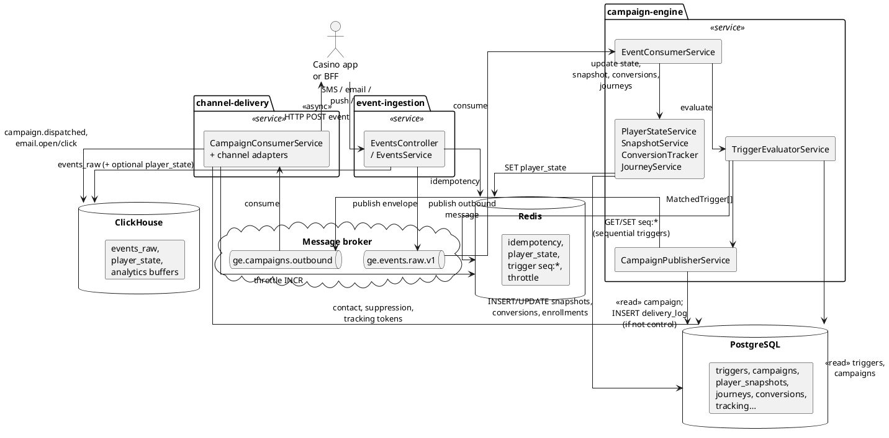
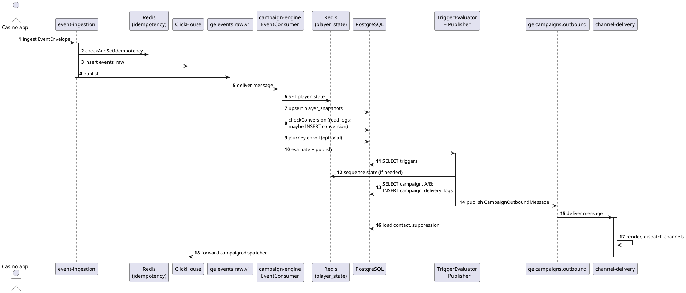
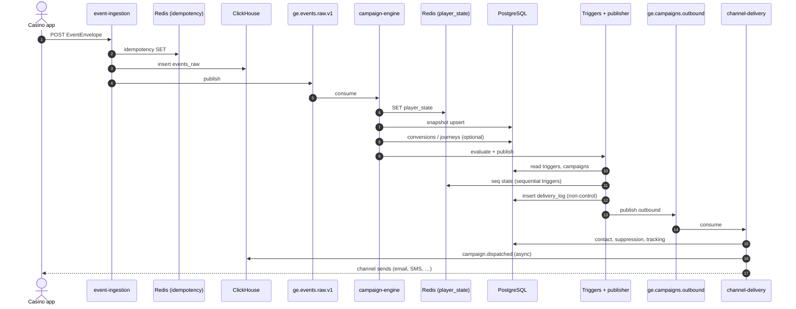
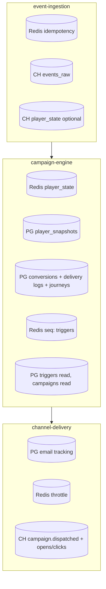

# Trigger flow when events arrive from the app

This document explains how a player or app event becomes outbound messaging across **multiple channels** (email, SMS, push, web push, WhatsApp, in-app/SSE, etc.) in this platform.

## End-to-end flow (high level)

1. **Ingest** — The casino app (or server) sends a validated **event envelope** to **event-ingestion** (HTTP). Idempotency is checked; optional enrichment runs; the event is written to analytics storage and published to the raw events queue.
2. **Campaign engine** — **campaign-engine** consumes from the raw events queue, updates **player state**, snapshots, conversion checks, and optional **journey** enrollment, then **evaluates triggers**.
3. **Triggers** — For each active trigger whose `event_type` matches and whose **conditions** pass (against player state, event payload, and optional scores), the engine builds a **matched trigger**. Single-event triggers fire immediately; **sequential** triggers advance Redis-backed sequence state until the full sequence completes.
4. **Campaign publish** — Each match is turned into an outbound message: campaign templates are loaded, **A/B test** and **control group** logic apply, and the message is published to RabbitMQ (`ge.campaigns` exchange, routing key `campaigns.outbound.v1`).
5. **Channel delivery** — **channel-delivery** consumes `ge.campaigns.outbound`, resolves the player’s contact info, applies suppression and policy, renders templates, then sends on one or more **channels** according to the campaign’s delivery mode.

## Diagram

```mermaid
flowchart LR
  subgraph App["Casino app / backend"]
    E[Player action → event]
  end

  subgraph Ingest["event-ingestion"]
    API[HTTP ingest]
    ID[Idempotency + optional enrichment]
    Q1[(ge.events.raw.v1)]
  end

  subgraph CE["campaign-engine"]
    EC[Event consumer]
    PS[Player state + snapshot]
    CV[Conversion tracker]
    JY[Journey enrollment]
    TE[Trigger evaluator]
    CP[Campaign publisher]
  end

  subgraph MQ2["RabbitMQ"]
    EX[ge.campaigns exchange]
    Q2[(ge.campaigns.outbound)]
  end

  subgraph CD["channel-delivery"]
    CC[Campaign consumer]
    R[Render + policy + suppression]
    CH{Delivery mode}
    WF[Waterfall: try channels in order]
    CCr[Concurrent: all channels in parallel]
    OUT[Per-channel send]
  end

  E --> API --> ID --> Q1
  Q1 --> EC --> PS --> CV --> JY --> TE --> CP
  CP --> EX --> Q2 --> CC --> R --> CH
  CH --> WF --> OUT
  CH --> CCr --> OUT
```

## UML diagrams

The **PlantUML** blocks below are standard UML (component + sequence). Paste them into [PlantUML Live](https://www.plantuml.com/plantuml/uml) or use a VS Code / IDE PlantUML extension to render. The **Mermaid** sequence diagram is the same flow in a form many Markdown viewers render natively (including GitHub).

### Component diagram (services, queues, data stores)

### Sequence diagram (happy path: one event → one campaign send)

### Sequence diagram (Mermaid — for Markdown preview)

## When Postgres, Redis, and ClickHouse write

Writes are listed in roughly the order they happen along the path. Some steps are **reads only** (for example loading active triggers); those are noted briefly so it is clear where the database is touched.

### 1. Event ingestion (`event-ingestion`)

| Store | What happens |
|--------|----------------|
| **Redis** | **Idempotency:** `checkAndSetIdempotency` records the `(brand_id, idempotency_key)` so duplicate HTTP submits are rejected before side effects. |
| **ClickHouse** | **`events_raw`:** each accepted envelope is inserted for analytics and raw replay. |
| **ClickHouse** | **`player_state` (optional):** after the raw insert, a fire-and-forget path may insert a row for **deposit / bet / session / registration**-style events (aggregated counters in ClickHouse; separate from Redis player state in campaign-engine). |
| **RabbitMQ** | Publish to the raw events queue and profile-update stream (not DB/Redis/CH, but part of the same ingest step). |

### 2. Campaign engine (`campaign-engine`, one message from `ge.events.raw.v1`)

| Store | What happens |
|--------|----------------|
| **Redis** | **`player_state:{brand_id}:{player_id}`:** merged state is **SET** with TTL after each event (`PlayerStateService.updateFromEvent`). This is what trigger conditions use. |
| **Postgres** | **`player_snapshots`:** **insert** on first seen player, else **update** in place (`SnapshotService.upsertFromState`) — async/non-blocking relative to ack in practice but still part of processing. |
| **Postgres** | **Conversion tracking:** **reads** `campaign_delivery_logs` and `campaigns`; if the event matches a campaign’s conversion type inside the attribution window, **`campaign_conversions`** gets an **insert** (`INSERT … ON CONFLICT DO NOTHING`). |
| **Postgres** | **Journeys (optional):** if a journey matches the event and entry rules, **`journey_enrollments`** may be **inserted** or prior rows **deleted/updated** (`JourneyService.enrollFromEvent`). |
| **Postgres** | **Triggers:** **read** active rows from **`triggers`** for `brand_id` + `event_type` (no write on evaluate). |
| **Redis** | **Sequential triggers:** keys `seq:{brand_id}:{player_id}:{sequence_id}` are **SET** / **DEL** as steps complete (`TriggerEvaluatorService`). |
| **Postgres** | **Campaign publish:** **read** `campaigns` (and A/B logic). When the player is **not** in the control group, **`campaign_delivery_logs`** gets a **save** (`ConversionTrackerService.logDelivery`) so later conversions can be attributed. |
| **Postgres** | **Conversions:** no extra write at publish beyond the delivery log above; conversion rows appear on **later** events when `checkConversion` matches. |

### 3. Channel delivery (`channel-delivery`, outbound message)

| Store | What happens |
|--------|----------------|
| **Postgres** | **Email tracking:** when email HTML is instrumented, **open/click tokens** are **inserted** into the tracking table (`TrackingService.createOpenToken` / `createClickToken`). |
| **Redis** | **Send throttle:** if daily caps apply, counters may be **INCR** / **EXPIRE** (and **DECR** on failure paths) per player/channel (`SendThrottleService`). |
| **ClickHouse** | **`events_raw_buffer`:** after dispatch, a **`campaign.dispatched`** row is forwarded for analytics (`CampaignEventForwarderService` → non-blocking). |
| **Postgres** | **Email opens/clicks:** when a tracking URL is hit, **`fired_at`** is **updated** on the token row; then **ClickHouse** receives **`email.opened`** / **`email.clicked`** via the same forwarder pattern. |

### Summary diagram (storage touchpoints)

## Multiple channels

### Where channels are defined

- **Triggers** store a comma-separated channel list (for example `email,sms,push`), which becomes the `channels` array on the outbound message.
- **Campaigns** can set **`waterfall`**: when true, channel-delivery tries channels **in list order** and **stops after the first successful** handoff; when false, it attempts **all listed channels concurrently** (`Promise.allSettled`).

So “multiple channels” can mean:

| Mode | Behaviour |
|------|-----------|
| **Concurrent** (default) | Email, SMS, push, etc. are all attempted for the same campaign send (subject to suppression, caps, and missing contact details per channel). |
| **Waterfall** | Same ordered list, but only until one channel succeeds — useful when you want a single best-effort path (for example SMS first, then email). |

### Supported delivery paths (conceptual)

Channel-delivery routes each channel name to the appropriate integration (email provider, SMS, mobile push, web push registry, WhatsApp, SSE/popup for in-app, etc.). Each path can independently fail, be suppressed, or be retried according to service rules.

### After send

- A **`campaign.dispatched`** style event can be forwarded to analytics (for example ClickHouse).
- **Webhooks** can be notified for downstream systems.

## Key queues and exchange (reference)

| Name | Role |
|------|------|
| `ge.events.raw.v1` | Raw validated events for campaign-engine consumption |
| `ge.campaigns` (topic) + `campaigns.outbound.v1` | Routed messages to `ge.campaigns.outbound` for channel-delivery |

## Related code (for maintainers)

- Ingest and publish to raw queue: `services/event-ingestion/src/events/events.service.ts`, `rabbitmq.service.ts`
- ClickHouse on ingest: `services/event-ingestion/src/events/clickhouse.service.ts` (`events_raw`, optional `player_state`)
- Redis idempotency: `services/event-ingestion/src/events/redis.service.ts` (used from `events.service.ts`)
- Consume events, evaluate triggers, publish campaigns: `services/campaign-engine/src/campaign/event-consumer.service.ts`, `trigger-evaluator.service.ts`, `campaign-publisher.service.ts`
- Redis player state: `services/campaign-engine/src/player-state/player-state.service.ts`; sequential triggers: `trigger-evaluator.service.ts`
- Postgres snapshots and conversions: `services/campaign-engine/src/snapshot/snapshot.service.ts`, `conversions/conversion-tracker.service.ts`
- Multi-channel dispatch: `services/channel-delivery/src/consumer/campaign-consumer.service.ts` (`dispatchWaterfall`, `dispatchConcurrent`, `sendChannel`)
- ClickHouse forward from delivery: `services/channel-delivery/src/analytics/campaign-event-forwarder.service.ts`, `tracking/tracking.service.ts`
