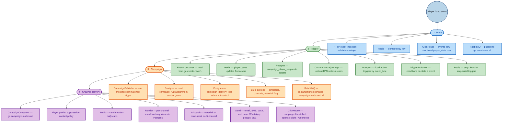
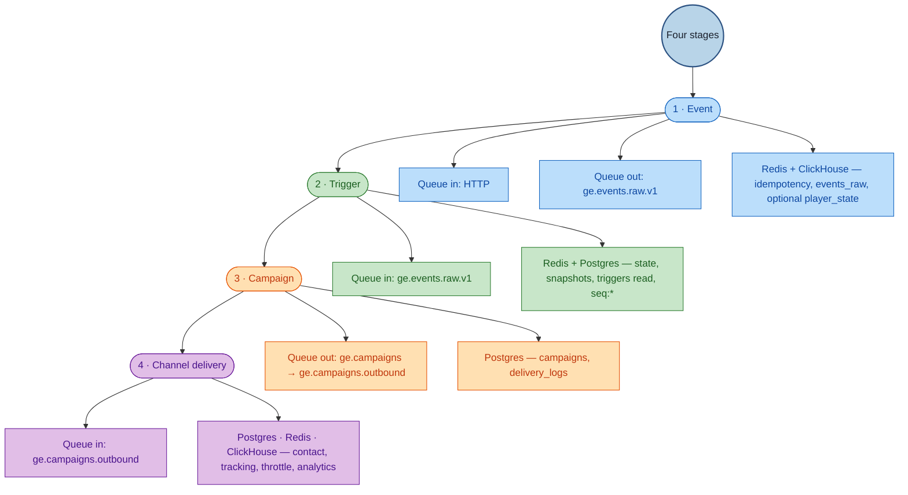
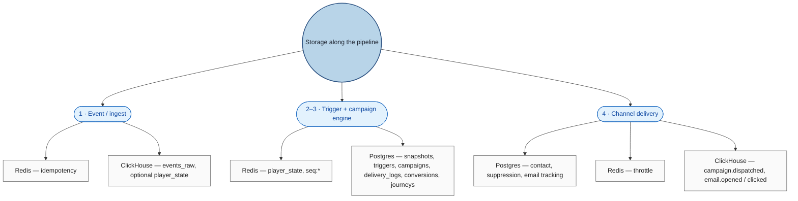

# Hierarchical flow: Event → Trigger → Campaign → Channel delivery

This page shows the pipeline as a **top-down tree** centered on four stages: **Event** → **Trigger** → **Campaign** → **Channel delivery**. Supporting detail hangs under each stage. For full prose and write matrices, see [trigger-explanation.md](./trigger-explanation.md).

**How to read:** Follow the **spine** (large rounded nodes **1 → 2 → 3 → 4**). Each stage lists what runs there. A second diagram lists **queues and data stores** next to the same four stages.

---

## Spine diagram — the four stages

### Spine in one sentence per stage

| # | Stage | Role |
|---|--------|------|
| **1** | **Event** | Accept the envelope, dedupe, persist analytics, enqueue for the engine. |
| **2** | **Trigger** | Refresh state, evaluate rules in DB + Redis, produce **matched triggers**. |
| **3** | **Campaign** | Turn each match into an **outbound campaign message** (templates, experiment, logs) and publish to the campaign queue. |
| **4** | **Channel delivery** | Consume that message, apply policy, and **send** on one or more channels. |

---

## Same four stages — messaging & storage only

---

## Compact tree — storage by stage

---

## Legend (spine diagram)

| Color | Stage | Covers |
|-------|--------|--------|
| Blue | **1 · Event** | Ingest service, dedupe, raw analytics, raw queue. |
| Green | **2 · Trigger** | Consumer, state, DB triggers, evaluation, sequences. |
| Orange | **3 · Campaign** | Publisher, campaign row, logs, RabbitMQ outbound message. |
| Purple | **4 · Channel delivery** | Consumer, policy, multi-channel send, analytics side effects. |

---

## See also

- [trigger-explanation.md](./trigger-explanation.md) — narrative flow, multi-channel modes, detailed DB/Redis/ClickHouse write list
