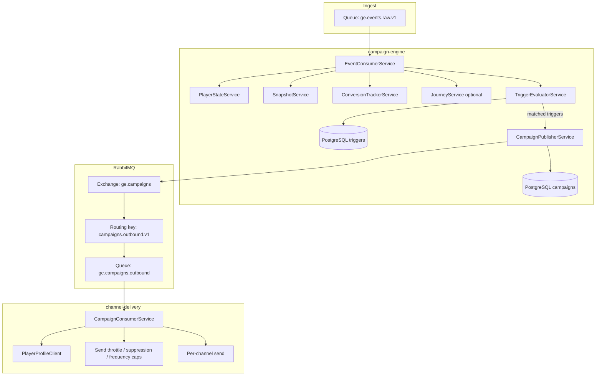
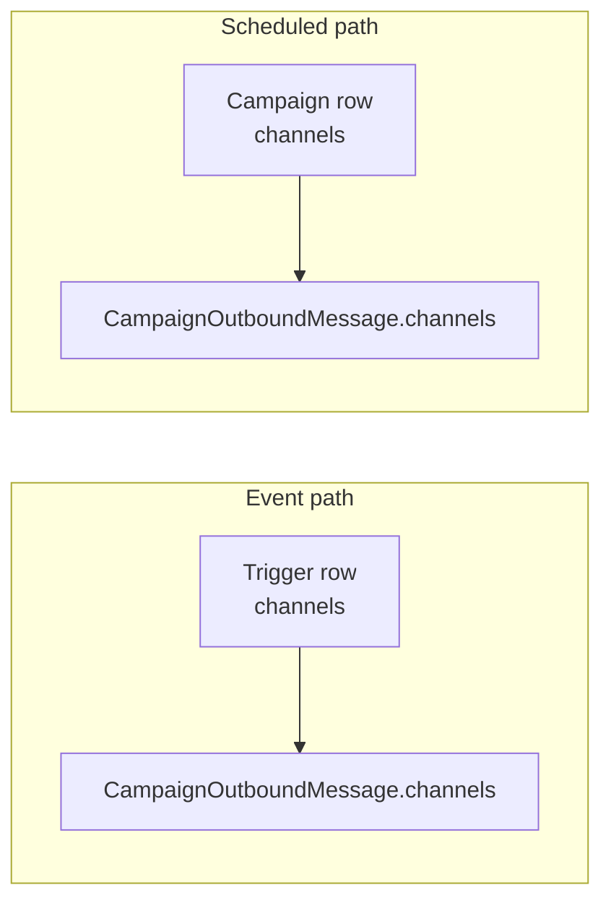
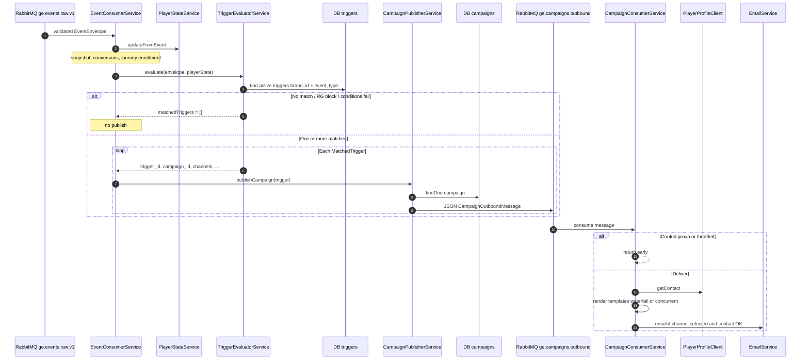
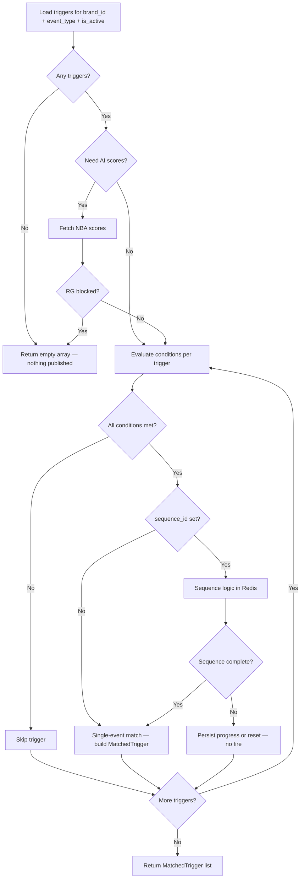
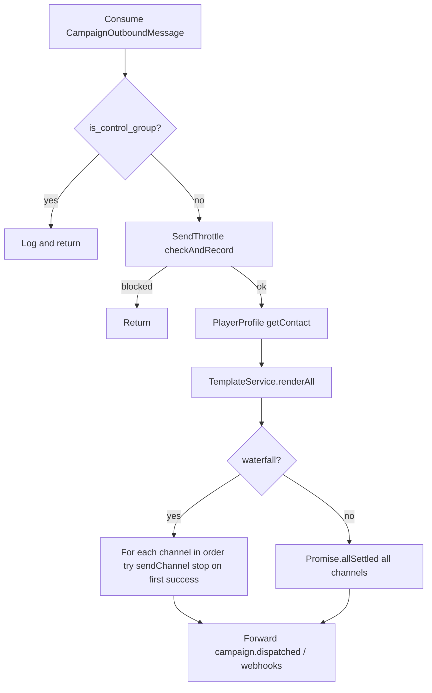

# Event trigger → channel delivery (events → campaigns → channels)

This document describes how **raw player events** flow through **campaign-engine** (trigger evaluation, campaign publish) into **RabbitMQ**, then **channel-delivery**, where messages are sent on **email, SMS, push, web push, popup, WhatsApp**, etc.

It complements [scheduled-campaign-flow.md](./scheduled-campaign-flow.md), which covers **scheduled** bulk sends. Here the entrypoint is **`ge.events.raw.v1`**, not the scheduler.

---

## 1. High-level architecture

---

## 2. Where `channels` come from (trigger vs campaign)

Both **`triggers`** and **`campaigns`** store a comma-separated channel list (e.g. `email,sms,push`). **They can differ** by design.

| Path | Channels used in the outbound message | Templates / waterfall / control group |
|------|----------------------------------------|--------------------------------------|
| **Event-driven** (`MatchedTrigger`) | **`triggers.channels`** (split to array in `buildMatchedTrigger`) | **`campaigns`** row loaded in `CampaignPublisherService` |
| **Scheduled** (`SchedulerService.dispatchToPlayers`) | **`campaigns.channels`** | Same campaign row |

---

## 3. Sequence: event → evaluate → publish → deliver

---

## 4. Trigger evaluation (decision flow)

---

## 5. channel-delivery: dispatch modes

---

## 6. Early exits and “no value” behavior (summary)

| Stage | Behavior |
|-------|----------|
| Invalid JSON / envelope | Event discarded (warn), no trigger evaluation |
| No triggers for event | `matchedTriggers` empty |
| Conditions not met | Trigger skipped |
| AI condition but scores unavailable | Condition fails (fail-safe) |
| RG risk block | All triggers suppressed for that evaluation |
| Sequential trigger | Wrong step or window exceeded → no match until sequence completes |
| Missing field in state + payload | Comparison fails → trigger does not match |
| Campaign row missing in publisher | Templates use `undefined`; `channels` still from trigger |
| channel-delivery: control group | No real delivery |
| channel-delivery: throttle | Return without send |
| Email: no `contact.email` | Channel returns false; waterfall may try next channel |

---

## 7. RabbitMQ (event-driven publish)

| Piece | Value |
|--------|--------|
| Events queue (in) | `ge.events.raw.v1` |
| Campaign exchange | `ge.campaigns` (topic) |
| Routing key | `campaigns.outbound.v1` |
| Outbound queue | `ge.campaigns.outbound` |

---

## Related source files

| Area | Location |
|------|----------|
| Event consume + orchestration | `services/campaign-engine/src/campaign/event-consumer.service.ts` |
| Trigger evaluation | `services/campaign-engine/src/triggers/trigger-evaluator.service.ts` |
| Trigger entity (`channels`) | `services/campaign-engine/src/triggers/trigger.entity.ts` |
| Campaign publish + templates | `services/campaign-engine/src/campaign/campaign-publisher.service.ts` |
| Campaign entity (`channels`) | `services/campaign-engine/src/campaign/campaign.entity.ts` |
| Scheduled bulk (channels from campaign) | `services/campaign-engine/src/scheduler/scheduler.service.ts` |
| Outbound consume + channels | `services/channel-delivery/src/consumer/campaign-consumer.service.ts` |
