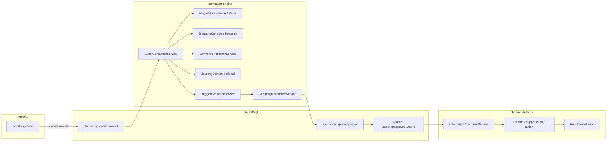
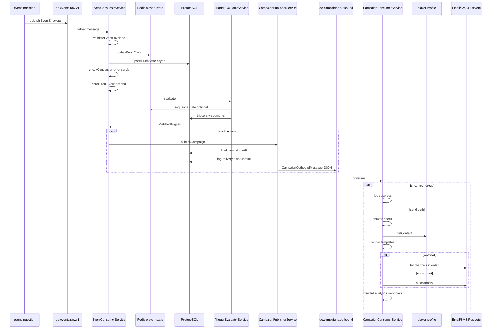

# Event-triggered campaign flow (ingestion → send)

This document describes how **incoming events** drive **triggered campaigns**: from RabbitMQ ingestion and **campaign-engine** (player state, triggers, publishing) through **channel-delivery** to **email, SMS, push, web push, popup, WhatsApp**, etc.

For **scheduled / bulk** sends, see [scheduled-campaign-flow.md](./scheduled-campaign-flow.md).

---

## High-level picture

---

## 1. Event reception and processing

### Ingress

- Validated `EventEnvelope` payloads are published to the topic exchange with routing key `events.raw.v1`, bound to queue **`ge.events.raw.v1`** (configurable via `RABBITMQ_QUEUE_RAW`).
- **event-ingestion** publishes after validation; other producers may also target the same queue/exchange pattern.

### Campaign engine (`EventConsumerService`)

1. **Parse and validate** JSON with `validateEventEnvelope` from `@gammaengage/shared`. Invalid envelopes are logged and the handler returns without rethrowing (message is ack’d; invalid payloads are not endlessly retried).
2. **Player state:** `PlayerStateService.updateFromEvent` applies `reduceEventIntoState` and stores state in **Redis** (`player_state:{brand_id}:{player_id}`), including a heuristic **segment** label on the state object.
3. **Snapshot (async, best-effort):** `SnapshotService.upsertFromState` persists financial/engagement metrics to **Postgres**; failures are logged as non-critical.
4. **Conversions (attribution):** `ConversionTrackerService.checkConversion` runs **before** new triggers fire, so this event can attribute conversions to **prior** campaign deliveries logged in `campaign_delivery_logs`.
5. **Journeys (optional):** If `JourneyService` is registered, `enrollFromEvent` may enroll the player when `trigger_event_type` and optional `entry_conditions` match.
6. **Triggers:** `TriggerEvaluatorService.evaluate` returns zero or more `MatchedTrigger` records.
7. **Publish:** For each match, `CampaignPublisherService.publishCampaign` publishes to **`ge.campaigns.outbound`** (via exchange `ge.campaigns`, routing key `campaigns.outbound.v1`).

### Processing failures

If `processMessage` throws, the consumer uses the shared **retry + DLQ** pattern (`republishToRetryOrDlq`) so transient errors are retried with backoff; after max retries the message goes to the dead-letter path.

---

## 2. Trigger evaluation

### Query

Active triggers are loaded for the event’s **`brand_id`**, **`event_type`**, and **`is_active: true`**.

### Responsible gaming (RG)

If any trigger needs AI score fields (`churn_score`, `vip_score`, `rg_risk_score`), scores are fetched once. If the player is **RG-blocked**, **no** triggers fire for that event (empty list).

### Conditions (AND)

All conditions in `trigger.conditions` must pass:

- **State / payload:** Values are read from `PlayerState` first, then `envelope.payload` for unknown fields. Operators include `eq`, `neq`, `gt`, `gte`, `lt`, `lte`, `in`, `not_in`.
- **AI scores:** If scores are required but unavailable, conditions that depend on them fail.
- **Segment definitions:** A condition with `field === 'segment_id'` uses `SegmentationService.playerMatchesSegment` against DB segment rules and **Redis** player state. Missing or inactive segment definitions, or **missing player state**, yield **false**.

### Single-event vs sequential triggers

- **No `sequence_id`:** If conditions pass, the trigger matches immediately.
- **With `sequence_id`:** Progress is stored in **Redis** (`seq:{brand_id}:{player_id}:{sequence_id}`). A match is emitted only when the **final** step completes within `sequence_window_seconds` (with defined reset and window-expiry behavior).

### Output

Each match becomes a `MatchedTrigger` carrying **`channels` parsed from the trigger row** (comma-separated list), plus `campaign_id`, `trigger_id`, `brand_id`, `player_id`, and `event_type`.

---

## 3. Segmentation

- **Built-in segment on state:** Every event updates `PlayerState.segment` via thresholds in `snapshot-reducer` (configurable via campaign-engine config env). Trigger conditions can reference fields on `PlayerState` (e.g. `deposit_count`, `segment`).
- **Named segments (DB):** Used when a trigger condition references **`segment_id`**. Evaluation is **part of trigger conditions**, not a separate post-match gate.
- **Scheduler bulk flows** (not this doc) use `segment_filter` on schedules and `campaign.channels` when building outbound messages.

---

## 4. Campaign-level vs trigger-level configuration

| Concern | Event-triggered path |
|--------|----------------------|
| **Channel list** | Taken from **`TriggerEntity.channels`** only (`MatchedTrigger.channels`). The outbound message does **not** merge in `CampaignEntity.channels`. |
| **Templates** | Loaded from **`CampaignEntity`** by `campaign_id` (email subject/HTML, SMS, push, web push, WhatsApp, popup, `promo_code_id`). |
| **A/B tests** | `AbTestService.assignVariant` may assign control or variant **B**; variant B can **override** template fields. |
| **Control group** | From A/B **or** deterministic bucket from `campaign.control_group_pct`. Control players still receive a published message with `is_control_group: true`; channel-delivery **suppresses** actual sends. |
| **Waterfall vs parallel** | **`CampaignEntity.waterfall`** is copied onto the outbound message. **Trigger** defines **which** channels appear and their **order**; **campaign** defines whether delivery tries one channel at a time until success (**waterfall**) or all listed channels **concurrently**. |

**Practical note:** If a trigger lists a channel the campaign has not templated (e.g. SMS on trigger, empty `sms_body` on campaign), **channel-delivery** still attempts that channel using rendered content where present and **defaults** where implemented (see `CampaignConsumerService`).

---

## 5. Outbound publishing (`CampaignPublisherService`)

- Loads the campaign for templates, control group / waterfall, and promo linkage.
- Builds `CampaignOutboundMessage` with enriched template fields and `is_control_group`.
- **Non–control-group** sends: `ConversionTrackerService.logDelivery` writes a **`campaign_delivery_logs`** row (for later conversion attribution).
- Publishes JSON to RabbitMQ **regardless** of control group (downstream respects `is_control_group`).

---

## 6. Channel-delivery (`CampaignConsumerService`)

1. **Control group:** If `is_control_group`, log and **return** (no throttle, no contact fetch, no send).
2. **Global throttle:** `SendThrottleService` (daily cap / quiet hours) may block the send.
3. **Contact:** `PlayerProfileClient.getContact` loads email, phone, tokens, opt-in flags.
4. **Templates:** `TemplateService.renderAll` runs Handlebars over campaign fields.
5. **Mode:** If `waterfall` is true, channels are tried **in order** until one send returns success; otherwise channels are attempted **concurrently** (`Promise.allSettled`).
6. **Per channel:** `SuppressionService`, `ContactPolicyService` (frequency caps), then channel-specific send (`EmailService`, `SmsService`, `PushService`, `WebPushService`, `WhatsAppService`, or SSE for `popup`). Failures may schedule **retries** via `DeliveryRetryService`.
7. **Analytics / integrations:** `CampaignEventForwarderService` forwards `campaign.dispatched` toward ClickHouse; **webhooks** may be notified.

---

## 7. Fallback and “no match” behavior

| Situation | Behavior |
|-----------|----------|
| Invalid event envelope | Logged; message ack’d; no triggers, no publish. |
| No active triggers for `event_type` / brand | `matchedTriggers.length === 0`; nothing published for triggers. |
| Conditions not met / sequence incomplete | Trigger skipped. |
| RG block | All triggers suppressed for that event. |
| `segment_id` condition, no Redis state | Condition fails. |
| AI condition, no scores | Condition fails. |
| Control group | Outbound message still published; **no** delivery log row for attribution; channel-delivery **does not send**. |
| Throttle blocks send | Logged; early return; no per-channel send. |
| Missing email/phone/tokens | Channel skipped or returns false; may trigger **retry** scheduling for failures. |
| Waterfall, all channels fail | Warning log “all channels exhausted”. |

---

## 8. Logging and auditing (by stage)

| Stage | What is recorded |
|-------|-------------------|
| Event consumer | Structured log: `eventId`, `eventType`, `matchedTriggers`, `latencyMs`. |
| Invalid envelope | Warning log; no DB row for the bad payload. |
| Trigger evaluator | Logs on match; warning on RG block; debug on sequence window resets. |
| Campaign publisher | Debug log on publish; `logDelivery` → **`campaign_delivery_logs`** for non-control sends. |
| Conversions | **`campaign_conversions`** (insert with conflict ignore) when a post-send event matches `conversion_event_types` within attribution window. |
| Snapshots | **`player_snapshots`** (and related) from `SnapshotService` when upsert succeeds. |
| Channel-delivery | Dispatch logs; suppression/cap debug logs; `campaign.dispatched` forward + webhooks; retry rows when delivery fails. |

---

## 9. End-to-end sequence diagram

---

## Related code (quick reference)

- Event consumer: `services/campaign-engine/src/campaign/event-consumer.service.ts`
- Trigger evaluation: `services/campaign-engine/src/triggers/trigger-evaluator.service.ts`
- Outbound publish: `services/campaign-engine/src/campaign/campaign-publisher.service.ts`
- Player state: `services/campaign-engine/src/player-state/player-state.service.ts`, `services/campaign-engine/src/snapshot/snapshot-reducer.ts`
- Segmentation: `services/campaign-engine/src/segmentation/segmentation.service.ts`
- Conversions: `services/campaign-engine/src/conversions/conversion-tracker.service.ts`
- Delivery: `services/channel-delivery/src/consumer/campaign-consumer.service.ts`
- Event publish to raw queue: `services/event-ingestion/src/events/rabbitmq.service.ts`
