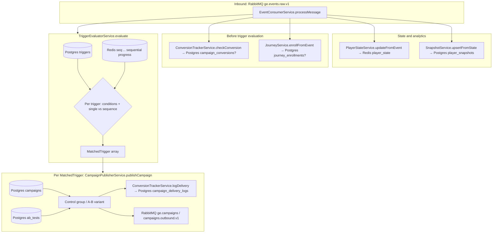
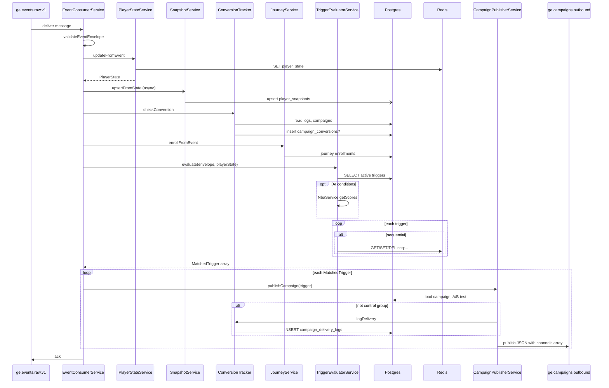

# Triggers and event consumption flow

This document describes how **campaign triggers** work in the campaign-engine service: database and Redis usage, function order when consuming events, publishing outbound campaigns, and behavior when multiple triggers match or multiple channels are configured.

## Concepts

- **Trigger definitions** are stored in PostgreSQL (`triggers` table, `TriggerEntity`). They are created and updated via campaign management APIs—not inserted at runtime when events fire.
- **Runtime** processing starts when an **event** is consumed from RabbitMQ queue `ge.events.raw.v1` (`EventConsumerService`).
- **Matching** is done by `TriggerEvaluatorService`, which loads active triggers for the event’s `brand_id` and `event_type`, evaluates JSON **conditions** against player state, payload, optional **segment** membership, and optional **AI scores** (churn / VIP / RG risk).
- **Sequential triggers** use **Redis** to track multi-step sequences; **single-event** triggers fire on one matching event when conditions pass.

## Trigger entity (what is configured)

Key fields (see `src/triggers/trigger.entity.ts`):

| Field | Role |
|--------|------|
| `brand_id`, `event_type` | Select which triggers run for an incoming event |
| `conditions` | JSON rules (player state, payload, `segment_id`, AI fields) |
| `campaign_id` | Campaign to send when the trigger fires |
| `channels` | Comma-separated list, e.g. `email,sms,push` → becomes an array on publish |
| `sequence_id`, `sequence_position`, `sequence_total_steps`, `sequence_window_seconds` | Optional multi-step sequence; Redis-backed |

## Order of operations when a message is consumed

`EventConsumerService.processMessage` runs in this order:

1. **Parse and validate** the JSON body as `EventEnvelope` (invalid → log, return; no ack failure path for bad JSON in the same way as processing errors—see consumer code).
2. **`PlayerStateService.updateFromEvent`** — updates **Redis** key `player_state:{brand_id}:{player_id}` (player state is not persisted to Postgres here).
3. **`SnapshotService.upsertFromState`** — **fire-and-forget**; upserts **Postgres** `player_snapshots` for analytics/metrics.
4. **`ConversionTrackerService.checkConversion`** — may **insert** into `campaign_conversions` if this event attributes to a recent campaign send (within attribution rules).
5. **`JourneyService.enrollFromEvent`** (if journey module present and `player_id` set) — may **insert/update/delete** **Postgres** journey enrollment rows for journeys whose `trigger_event_type` matches.
6. **`TriggerEvaluatorService.evaluate`** — **reads** `triggers` from Postgres; **reads/writes Redis** for sequential progress (`seq:{brand_id}:{player_id}:{sequence_id}`).
7. **For each** `MatchedTrigger`: **`CampaignPublisherService.publishCampaign`** — reads campaign (and A/B test), may **insert** `campaign_delivery_logs` if not in control group, then **publishes** to RabbitMQ.

Source: `src/campaign/event-consumer.service.ts`.

## Where data is written (single consumed event)

| Step | Service | Storage | What |
|------|---------|---------|------|
| State | `PlayerStateService` | **Redis** | Aggregated player state |
| Snapshot | `SnapshotService` | **Postgres** | `player_snapshots` (async) |
| Conversions | `ConversionTrackerService.checkConversion` | **Postgres** | `campaign_conversions` (conditional) |
| Journeys | `JourneyService.enrollFromEvent` | **Postgres** | `journey_enrollments` (conditional) |
| Sequences | `TriggerEvaluatorService` | **Redis** | Sequence progress keys |
| Triggers | `TriggerEvaluatorService` | **Postgres** | **Read-only** trigger definitions |
| Send attribution | `ConversionTrackerService.logDelivery` | **Postgres** | `campaign_delivery_logs` (per publish, non–control-group) |
| Outbound | `CampaignPublisherService` | **RabbitMQ** | `ge.campaigns` / routing `campaigns.outbound.v1` |

**Note:** Firing a trigger does **not** insert rows into the `triggers` table.

## Trigger evaluation details

- Loads triggers: `brand_id`, `event_type`, `is_active: true`.
- If any condition uses `churn_score`, `vip_score`, or `rg_risk_score`, AI scores are fetched once via `NbaService`. If the player is **RG-blocked**, evaluation returns **no** matches.
- **Single-event** (`sequence_id` null): conditions met → one `MatchedTrigger`.
- **Sequential**: only when the expected step arrives in order and (if configured) within the time window; on completion the Redis key is removed and one `MatchedTrigger` is produced. Wrong step order can reset or ignore progress (see `trigger-evaluator.service.ts`).

## Publishing

- **Inbound:** The consumer **acks** the raw event after successful `processMessage` (or retry/DLQ on thrown errors).
- **Outbound:** Each `publishCampaign` builds a `CampaignOutboundMessage` (trigger id, campaign id, brand, player, **`channels` array**, templates, `is_control_group`, `waterfall`, etc.) and publishes to the campaign exchange. **Control-group** assignments still publish a message; downstream should skip actual delivery when `is_control_group` is true.
- **Delivery logging:** `logDelivery` runs only when **not** in the control group, so conversions can be attributed from `campaign_delivery_logs`.

## Multiple matched triggers

- Evaluation returns an **array** of `MatchedTrigger`. Each DB row that matches independently becomes one entry.
- The consumer loops **`await publishCampaign(trigger)`** for **each** match → **one RabbitMQ message per matched trigger** (order follows evaluation order).
- **Multiple channels on one trigger:** One outbound message includes a **`channels` array** with every channel from the trigger string (e.g. email + SMS + push in one payload).

## Diagrams

### Hierarchical flow (parent → child)

### Sequence diagram (multiple triggers, multi-channel)

## Related source files

| Area | Path |
|------|------|
| Consumer | `src/campaign/event-consumer.service.ts` |
| Evaluator | `src/triggers/trigger-evaluator.service.ts` |
| Trigger schema | `src/triggers/trigger.entity.ts` |
| Publisher | `src/campaign/campaign-publisher.service.ts` |
| Conversions | `src/conversions/conversion-tracker.service.ts` |
| Player state | `src/player-state/player-state.service.ts` |
| Snapshots | `src/snapshot/snapshot.service.ts` |
| Journeys (parallel path) | `src/journey/journey.service.ts` |

Journey **scheduled** steps (cron) use a separate path: `JourneyService.processDueEnrollments` / `publishStep`, not the event trigger loop above.
