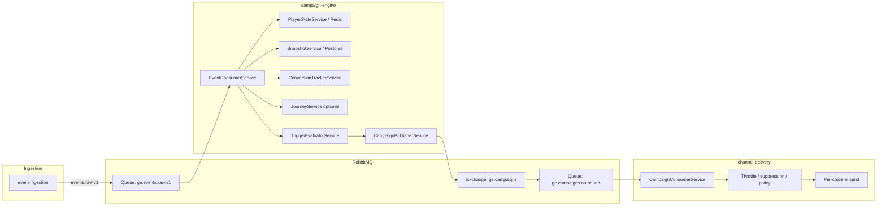
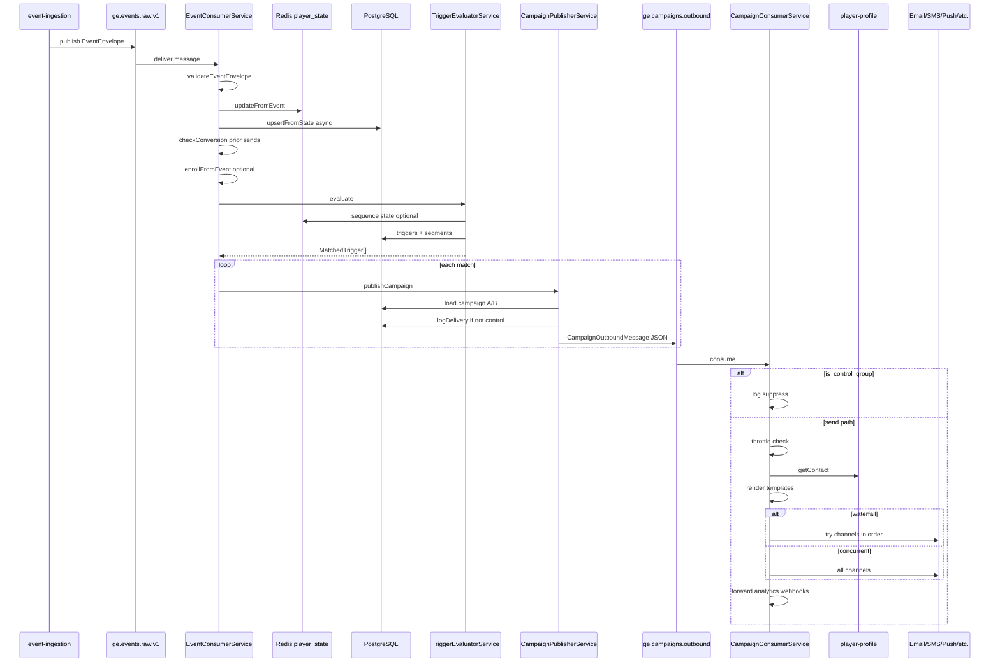

# Event-triggered campaign flow (ingestion → send)

This document describes how **incoming events** drive **triggered campaigns**: from RabbitMQ ingestion and **campaign-engine** (player state, triggers, publishing) through **channel-delivery** to **email, SMS, push, web push, popup, WhatsApp**, etc.

For **scheduled / bulk** sends, see [scheduled-campaign-flow.md](./scheduled-campaign-flow.md).

---

## High-level picture



---

## 1. Event reception and processing

### Ingress

- Validated `EventEnvelope` payloads are published to the topic exchange with routing key `events.raw.v1`, bound to queue **`ge.events.raw.v1`** (configurable via `RABBITMQ_QUEUE_RAW`).
- **event-ingestion** publishes after validation; other producers may also target the same queue/exchange pattern.

### Campaign engine (`EventConsumerService`)

1. **Parse and validate** JSON with `validateEventEnvelope` from `@gammaengage/shared`. Invalid envelopes are logged and the handler returns without rethrowing (message is ack’d; invalid payloads are not endlessly retried).
2. **Player state:** `PlayerStateService.updateFromEvent` applies `reduceEventIntoState` and stores state in **Redis** (`player_state:{brand_id}:{player_id}`), including a heuristic **segment** label on the state object.
3. **Snapshot (async, best-effort):** `SnapshotService.upsertFromState` persists financial/engagement metrics to **Postgres**; failures are logged as non-critical.
4. **Conversions (attribution):** `ConversionTrackerService.checkConversion` runs **before** new triggers fire, so this event can attribute conversions to **prior** campaign deliveries logged in `campaign_delivery_logs`.
5. **Journeys (optional):** If `JourneyService` is registered, `enrollFromEvent` may enroll the player when `trigger_event_type` and optional `entry_conditions` match.
6. **Triggers:** `TriggerEvaluatorService.evaluate` returns zero or more `MatchedTrigger` records.
7. **Publish:** For each match, `CampaignPublisherService.publishCampaign` publishes to **`ge.campaigns.outbound`** (via exchange `ge.campaigns`, routing key `campaigns.outbound.v1`).

### Processing failures

If `processMessage` throws, the consumer uses the shared **retry + DLQ** pattern (`republishToRetryOrDlq`) so transient errors are retried with backoff; after max retries the message goes to the dead-letter path.

---

## 2. Trigger evaluation

### Query

Active triggers are loaded for the event’s **`brand_id`**, **`event_type`**, and **`is_active: true`**.

### Responsible gaming (RG)

If any trigger needs AI score fields (`churn_score`, `vip_score`, `rg_risk_score`), scores are fetched once. If the player is **RG-blocked**, **no** triggers fire for that event (empty list).

### Conditions (AND)

All conditions in `trigger.conditions` must pass:

- **State / payload:** Values are read from `PlayerState` first, then `envelope.payload` for unknown fields. Operators include `eq`, `neq`, `gt`, `gte`, `lt`, `lte`, `in`, `not_in`.
- **AI scores:** If scores are required but unavailable, conditions that depend on them fail.
- **Segment definitions:** A condition with `field === 'segment_id'` uses `SegmentationService.playerMatchesSegment` against DB segment rules and **Redis** player state. Missing or inactive segment definitions, or **missing player state**, yield **false**.

### Single-event vs sequential triggers

- **No `sequence_id`:** If conditions pass, the trigger matches immediately.
- **With `sequence_id`:** Progress is stored in **Redis** (`seq:{brand_id}:{player_id}:{sequence_id}`). A match is emitted only when the **final** step completes within `sequence_window_seconds` (with defined reset and window-expiry behavior).

### Output

Each match becomes a `MatchedTrigger` carrying **`channels` parsed from the trigger row** (comma-separated list), plus `campaign_id`, `trigger_id`, `brand_id`, `player_id`, and `event_type`.

---

## 3. Segmentation

- **Built-in segment on state:** Every event updates `PlayerState.segment` via thresholds in `snapshot-reducer` (configurable via campaign-engine config env). Trigger conditions can reference fields on `PlayerState` (e.g. `deposit_count`, `segment`).
- **Named segments (DB):** Used when a trigger condition references **`segment_id`**. Evaluation is **part of trigger conditions**, not a separate post-match gate.
- **Scheduler bulk flows** (not this doc) use `segment_filter` on schedules and `campaign.channels` when building outbound messages.

---

## 4. Campaign-level vs trigger-level configuration

| Concern | Event-triggered path |
|--------|----------------------|
| **Channel list** | Taken from **`TriggerEntity.channels`** only (`MatchedTrigger.channels`). The outbound message does **not** merge in `CampaignEntity.channels`. |
| **Templates** | Loaded from **`CampaignEntity`** by `campaign_id` (email subject/HTML, SMS, push, web push, WhatsApp, popup, `promo_code_id`). |
| **A/B tests** | `AbTestService.assignVariant` may assign control or variant **B**; variant B can **override** template fields. |
| **Control group** | From A/B **or** deterministic bucket from `campaign.control_group_pct`. Control players still receive a published message with `is_control_group: true`; channel-delivery **suppresses** actual sends. |
| **Waterfall vs parallel** | **`CampaignEntity.waterfall`** is copied onto the outbound message. **Trigger** defines **which** channels appear and their **order**; **campaign** defines whether delivery tries one channel at a time until success (**waterfall**) or all listed channels **concurrently**. |

**Practical note:** If a trigger lists a channel the campaign has not templated (e.g. SMS on trigger, empty `sms_body` on campaign), **channel-delivery** still attempts that channel using rendered content where present and **defaults** where implemented (see `CampaignConsumerService`).

---

## 5. Outbound publishing (`CampaignPublisherService`)

- Loads the campaign for templates, control group / waterfall, and promo linkage.
- Builds `CampaignOutboundMessage` with enriched template fields and `is_control_group`.
- **Non–control-group** sends: `ConversionTrackerService.logDelivery` writes a **`campaign_delivery_logs`** row (for later conversion attribution).
- Publishes JSON to RabbitMQ **regardless** of control group (downstream respects `is_control_group`).

---

## 6. Channel-delivery (`CampaignConsumerService`)

1. **Control group:** If `is_control_group`, log and **return** (no throttle, no contact fetch, no send).
2. **Global throttle:** `SendThrottleService` (daily cap / quiet hours) may block the send.
3. **Contact:** `PlayerProfileClient.getContact` loads email, phone, tokens, opt-in flags.
4. **Templates:** `TemplateService.renderAll` runs Handlebars over campaign fields.
5. **Mode:** If `waterfall` is true, channels are tried **in order** until one send returns success; otherwise channels are attempted **concurrently** (`Promise.allSettled`).
6. **Per channel:** `SuppressionService`, `ContactPolicyService` (frequency caps), then channel-specific send (`EmailService`, `SmsService`, `PushService`, `WebPushService`, `WhatsAppService`, or SSE for `popup`). Failures may schedule **retries** via `DeliveryRetryService`.
7. **Analytics / integrations:** `CampaignEventForwarderService` forwards `campaign.dispatched` toward ClickHouse; **webhooks** may be notified.

---

## 7. Fallback and “no match” behavior

| Situation | Behavior |
|-----------|----------|
| Invalid event envelope | Logged; message ack’d; no triggers, no publish. |
| No active triggers for `event_type` / brand | `matchedTriggers.length === 0`; nothing published for triggers. |
| Conditions not met / sequence incomplete | Trigger skipped. |
| RG block | All triggers suppressed for that event. |
| `segment_id` condition, no Redis state | Condition fails. |
| AI condition, no scores | Condition fails. |
| Control group | Outbound message still published; **no** delivery log row for attribution; channel-delivery **does not send**. |
| Throttle blocks send | Logged; early return; no per-channel send. |
| Missing email/phone/tokens | Channel skipped or returns false; may trigger **retry** scheduling for failures. |
| Waterfall, all channels fail | Warning log “all channels exhausted”. |

---

## 8. Logging and auditing (by stage)

| Stage | What is recorded |
|-------|-------------------|
| Event consumer | Structured log: `eventId`, `eventType`, `matchedTriggers`, `latencyMs`. |
| Invalid envelope | Warning log; no DB row for the bad payload. |
| Trigger evaluator | Logs on match; warning on RG block; debug on sequence window resets. |
| Campaign publisher | Debug log on publish; `logDelivery` → **`campaign_delivery_logs`** for non-control sends. |
| Conversions | **`campaign_conversions`** (insert with conflict ignore) when a post-send event matches `conversion_event_types` within attribution window. |
| Snapshots | **`player_snapshots`** (and related) from `SnapshotService` when upsert succeeds. |
| Channel-delivery | Dispatch logs; suppression/cap debug logs; `campaign.dispatched` forward + webhooks; retry rows when delivery fails. |

---

## 9. Code paths and storage side effects

Below, each snippet is tied to **what it does** and **what it reads or writes** (PostgreSQL, Redis, RabbitMQ, ClickHouse, HTTP). Line references point at the current repo layout.

### 9.1 Ingestion → raw events queue (RabbitMQ only)

**What it does:** After validation, **event-ingestion** publishes the `EventEnvelope` to the topic exchange; messages land on **`ge.events.raw.v1`**. No application DB write here.

```61:79:services/event-ingestion/src/events/rabbitmq.service.ts
  async publishEvent(envelope: EventEnvelope): Promise<void> {
    let lastError: Error | null = null;

    for (let attempt = 1; attempt <= PUBLISH_MAX_RETRIES; attempt++) {
      const attemptStart = Date.now();
      try {
        const published = await this.publisher.publish(
          this.routingKey,
          envelope,
          this.reqIdPublishOptions(),
        );

        if (published) {
          const publishLatencyMs = Date.now() - attemptStart;
          this.logger.debug(
            { eventId: envelope.event_id, routingKey: this.routingKey, publishLatencyMs },
            'Event published to RabbitMQ',
          );
          return;
        }
```

| Storage | Effect |
|--------|--------|
| **RabbitMQ** | Persistent message to the configured queue (default `ge.events.raw.v1`, routing key `events.raw.v1`). |

---

### 9.2 Event consumer: validate, state, snapshot, conversions, triggers, publish

**What it does:** Parses the body, validates the envelope, updates **Redis** player state, kicks off an async **Postgres** snapshot upsert, runs **conversion attribution** against prior **Postgres** delivery logs, optionally enrolls journeys, evaluates triggers, and for each match calls the campaign publisher.

```101:140:services/campaign-engine/src/campaign/event-consumer.service.ts
  private async processMessage(msg: Message): Promise<void> {
    const startMs = Date.now();
    let envelope: EventEnvelope;

    try {
      const raw = JSON.parse(msg.content.toString()) as unknown;
      envelope = validateEventEnvelope(raw);
    } catch (error) {
      this.logger.warn({ error }, 'Invalid event envelope received from queue — discarding');
      return;
    }

    const playerState = await this.playerStateService.updateFromEvent(envelope);

    // Persist snapshot per player (AC1: financial + engagement metrics)
    this.snapshotService
      .upsertFromState(playerState)
      .catch((err) =>
        this.logger.warn(
          { err, playerId: envelope.player_ref.external_player_id },
          'Snapshot upsert failed (non-critical)',
        ),
      );

    // Check and record conversions before evaluating new triggers
    await this.conversionTracker.checkConversion(envelope);

    // Enroll in matching journeys (pass player state for entry_conditions evaluation)
    const playerId = envelope.player_ref.external_player_id || envelope.player_ref.visitor_id || '';
    if (this.journeyService && playerId) {
      await this.journeyService
        .enrollFromEvent(envelope.brand_id, playerId, envelope.event_type, playerState)
        .catch((err) => this.logger.warn({ err }, 'Journey enrollment failed'));
    }

    const matchedTriggers = await this.triggerEvaluator.evaluate(envelope, playerState);

    for (const trigger of matchedTriggers ) {
      await this.campaignPublisher.publishCampaign(trigger);
    }
```

| Storage | Effect |
|--------|--------|
| **None** | Invalid JSON / failed `validateEventEnvelope`: early `return` (message still ack’d). |
| **Redis** | `updateFromEvent` — see §9.3. |
| **PostgreSQL** | `upsertFromState` — see §9.4 (async). |
| **PostgreSQL** | `checkConversion` — reads `campaign_delivery_logs`, may **insert** into `campaign_conversions` (§9.5). |
| **PostgreSQL** | Journey enrollment (if enabled) may insert/update journey tables (not expanded here). |
| **PostgreSQL** | `TriggerEvaluator` **reads** `triggers` (+ segment definitions when conditions use `segment_id`). |
| **Redis** | Sequential triggers **read/write** sequence keys (§9.6). |
| **RabbitMQ** | `publishCampaign` **publishes** to outbound (§9.7); may **insert** delivery log in Postgres first. |

---

### 9.3 Player state (`PlayerStateService`)

**What it does:** Merges the event into rolling aggregates via `reduceEventIntoState`, then **writes** the full `PlayerState` JSON to Redis with a **90-day TTL**.

```34:46:services/campaign-engine/src/player-state/player-state.service.ts
  async updateFromEvent(envelope: EventEnvelope): Promise<PlayerState> {
    const playerId = envelope.player_ref.external_player_id || envelope.player_ref.visitor_id || '';
    const brandId = envelope.brand_id;
    const key = this.stateKey(brandId, playerId);

    const existing = await this.getState(brandId, playerId);
    const state = reduceEventIntoState(existing, envelope);

    await this.redis.setex(key, PLAYER_STATE_TTL_SECONDS, JSON.stringify(state));

    this.logger.debug({ playerId, brandId, segment: state.segment }, 'Player state updated');

    return state;
  }
```

| Storage | Effect |
|--------|--------|
| **Redis** | **SETEX** on key `player_state:{brand_id}:{player_id}` — value is JSON `PlayerState` (counts, `segment`, `last_event_type`, etc.). TTL: 90 days (`PLAYER_STATE_TTL_SECONDS`). |

---

### 9.4 Player snapshot (`SnapshotService`)

**What it does:** Upserts the latest **player_snapshots** row for analytics/BI (insert version 1 if missing, else update same version per product rules).

```42:74:services/campaign-engine/src/snapshot/snapshot.service.ts
  async upsertFromState(
    state: PlayerState,
    behavioralScores?: {
      churn_score?: number;
      vip_score?: number;
      rg_risk_score?: number;
    },
  ): Promise<PlayerSnapshotEntity> {
    const maxVersion = await this.getLatestVersion(state.brand_id, state.player_id);
    const version = maxVersion === 0 ? 1 : maxVersion;

    const row: Record<string, unknown> = {
      brand_id: state.brand_id,
      player_id: state.player_id,
      version,
      visitor_id: state.visitor_id ?? undefined,
      deposit_count: state.deposit_count,
      total_deposit_amount: Number(state.total_deposit_amount),
      bet_count: state.bet_count,
      total_bet_amount: Number(state.total_bet_amount),
      session_count: state.session_count,
      last_event_type: state.last_event_type,
      last_seen: state.last_seen ? new Date(state.last_seen) : undefined,
      segment: state.segment,
      churn_score: behavioralScores?.churn_score,
      vip_score: behavioralScores?.vip_score,
      rg_risk_score: behavioralScores?.rg_risk_score,
    };

    if (maxVersion === 0) {
      await this.snapshotRepo.insert(row as unknown as PlayerSnapshotEntity);
    } else {
      await this.snapshotRepo.update(
```

| Storage | Effect |
|--------|--------|
| **PostgreSQL** | Table **`player_snapshots`**: **INSERT** first time for `(brand_id, player_id)` / version 1; thereafter **UPDATE** same version row with latest metrics and `segment`. |

---

### 9.5 Conversions: attribute this event (`checkConversion`)

**What it does:** Loads recent **delivery logs** for the player, eligible **campaigns**, and if the event type is a configured conversion and within the attribution window, **inserts** a conversion row (idempotent via `OR IGNORE` / unique index).

```56:114:services/campaign-engine/src/conversions/conversion-tracker.service.ts
  async checkConversion(envelope: EventEnvelope): Promise<void> {
    const playerId = envelope.player_ref.external_player_id || envelope.player_ref.visitor_id || '';
    if (!playerId) return;

    const brandId = envelope.brand_id;
    const eventType = envelope.event_type;

    // Efficiently: only load campaigns that have this event type in conversion_event_types.
    // Use a single query that joins delivery log + campaign filter.
    const now = new Date();
    const windowStart = new Date(now.getTime() - 30 * 24 * 60 * 60 * 1000);

    // Step 1: find recent delivery logs for this player
    const recentLogs = await this.deliveryLogRepo.find({
      select: ['campaign_id', 'sent_at'],
      where: { brand_id: brandId, player_id: playerId, sent_at: MoreThan(windowStart) },
    });
    if (recentLogs.length === 0) return;

    // Step 2: load only campaigns that include this event_type as a conversion type
    const campaignIds = [...new Set(recentLogs.map((l) => l.campaign_id))];
    const campaigns = await this.campaignRepo.find({
      select: ['id', 'conversion_event_types', 'attribution_window_hours'],
      where: { id: In(campaignIds) },
    });
    // ... eligibleCampaigns filter ...

      try {
        await this.conversionRepo
          .createQueryBuilder()
          .insert()
          .into('campaign_conversions')
          .values({
            brand_id: brandId,
            campaign_id: campaign.id,
            player_id: playerId,
            converted_event_type: eventType,
            revenue,
            hours_to_convert: hoursElapsed,
          })
          .orIgnore()
          .execute();
```

| Storage | Effect |
|--------|--------|
| **PostgreSQL** | **SELECT** from **`campaign_delivery_logs`** (last 30 days) and **`campaigns`**. |
| **PostgreSQL** | **INSERT** into **`campaign_conversions`** when eligible; duplicates suppressed by unique index / `OR IGNORE`. |

---

### 9.6 Trigger evaluation and sequential triggers (Postgres + Redis)

**What it does:** **Reads** active rows from **`triggers`**. For sequential triggers, stores partial progress under **`seq:{brand_id}:{player_id}:{sequence_id}`**; **SETEX** with TTL (window or 7-day default), **DEL** when sequence completes or resets.

```119:197:services/campaign-engine/src/triggers/trigger-evaluator.service.ts
  private async evaluateSequence(
    trigger: TriggerEntity,
    envelope: EventEnvelope,
    playerId: string,
  ): Promise<boolean> {
    const key = `seq:${envelope.brand_id}:${playerId}:${trigger.sequence_id}`;

    // Read existing sequence progress
    const raw = await this.redis.get(key);
    let steps: SequenceStep[] = [];
    // ... parse / corrupt reset ...

    // ... step logic ...

    if (trigger.sequence_position >= trigger.sequence_total_steps) {
      // All steps done — clean up and fire the campaign
      await this.redis.del(key);
      return true;
    }

    // More steps remain — persist progress and wait
    await this.persistSequence(key, steps, trigger.sequence_window_seconds);
    return false;
  }

  private async persistSequence(
    key: string,
    steps: SequenceStep[],
    windowSeconds: number,
  ): Promise<void> {
    const ttl = windowSeconds > 0 ? windowSeconds : 60 * 60 * 24 * 7; // 7-day default
    await this.redis.setex(key, ttl, JSON.stringify(steps));
  }
```

**Segment conditions:** `segment_id` conditions call `SegmentationService.playerMatchesSegment`, which **reads** **`segment_definitions`** and **`player_state`** from Redis — no separate “segment result” table write on the hot path.

| Storage | Effect |
|--------|--------|
| **PostgreSQL** | **SELECT** from **`triggers`** (and **`segment_definitions`** when needed). |
| **Redis** | **GET / SETEX / DEL** on `seq:…` keys for multi-step triggers. |

---

### 9.7 Outbound message + delivery log (`CampaignPublisherService`)

**What it does:** **Reads** **`campaigns`** for templates and flags. If the player is **not** in the control group, **inserts** a **`campaign_delivery_logs`** row for attribution. **Publishes** JSON to RabbitMQ (**exchange** `ge.campaigns`, **routing key** `campaigns.outbound.v1` → queue **`ge.campaigns.outbound`**).

```130:153:services/campaign-engine/src/campaign/campaign-publisher.service.ts
    if (isControlGroup) {
      this.logger.debug(
        { campaignId: trigger.campaign_id, playerId: trigger.player_id },
        `Player assigned to control group (${controlGroupPct}%) — skipping delivery`,
      );
    } else {
      // Log delivery for conversion attribution (only for real sends, not control group)
      await this.conversionTracker.logDelivery(
        trigger.brand_id,
        trigger.campaign_id,
        trigger.player_id,
        trigger.trigger_id,
        trigger.channels,
      );
    }

    // Publish regardless — channel-delivery respects is_control_group flag
    const publishStart = Date.now();
    this.channel.publish(
      CAMPAIGN_EXCHANGE,
      CAMPAIGN_ROUTING_KEY,
      Buffer.from(JSON.stringify(message)),
      { persistent: true, contentType: 'application/json' },
    );
```

```30:45:services/campaign-engine/src/conversions/conversion-tracker.service.ts
  /** Log a campaign dispatch so it can be attributed later. */
  async logDelivery(
    brandId: string,
    campaignId: string,
    playerId: string,
    triggerId: string,
    channels: string[],
  ): Promise<void> {
    const log = this.deliveryLogRepo.create({
      brand_id: brandId,
      campaign_id: campaignId,
      player_id: playerId,
      trigger_id: triggerId,
      channels: channels.join(','),
    });
    await this.deliveryLogRepo.save(log);
  }
```

| Storage | Effect |
|--------|--------|
| **PostgreSQL** | **SELECT** `campaigns` by id. |
| **PostgreSQL** | **INSERT** into **`campaign_delivery_logs`** (`brand_id`, `campaign_id`, `player_id`, `trigger_id`, `channels`, `sent_at` auto) — **skipped** for control group. |
| **RabbitMQ** | **PUBLISH** persistent JSON to outbound queue (always, including control group). |

---

### 9.8 Channel-delivery: throttle, contact, caps, send, analytics, retries

**Global throttle (`SendThrottleService`):** Quiet hours are computed in memory; daily cap uses **Redis INCR / EXPIRE / DECR** on a per-player day key.

```70:106:services/channel-delivery/src/send-throttle/send-throttle.service.ts
  async checkAndRecord(
    brandId: string,
    playerId: string,
    channel: string,
  ): Promise<ThrottleVerdict> {
    const now = new Date();

    // ── Gate 1: Quiet hours ──────────────────────────────────────────────────
    const quietVerdict = this.checkQuietHours(now);
    if (!quietVerdict.allowed) {
      this.logger.debug({ brandId, playerId, channel }, 'Throttle: send blocked — quiet hours');
      return quietVerdict;
    }

    // ── Gate 2: Daily send cap ────────────────────────────────────────────────
    const capKey = this.dailyCapKey(brandId, playerId, now);
    const startMs = Date.now();
    try {
      const count = await this.redis.incr(capKey);
      if (count === 1) {
        // First send today — set TTL to expire at next UTC midnight
        const ttl = this.secondsUntilMidnightUtc(now);
        await this.redis.expire(capKey, ttl);
      }
      // ...
      if (count > this.dailyCap) {
        await this.redis.decr(capKey);
        return { allowed: false, reason: 'daily_cap_exceeded' };
      }
```

**Frequency caps (`ContactPolicyService`):** **Reads** contact policies from **PostgreSQL**; per-channel caps use **Redis** keys like `freq:{brandId}:{playerId}:{channel}:…` via Lua (`atomicCheckAndIncrement`).

**ClickHouse:** After dispatch, `CampaignEventForwarderService.forward` **inserts** into **`events_raw_buffer`** (when `CLICKHOUSE_HOST` is set).

```57:80:services/channel-delivery/src/analytics/campaign-event-forwarder.service.ts
  async forward(event: CampaignEvent): Promise<void> {
    if (!this.isConfigured || !this.client) return;
    const startMs = Date.now();
    try {
      await this.client.insert({
        table: 'events_raw_buffer',
        values: [
          {
            event_id: event.event_id,
            brand_id: event.brand_id,
            event_type: event.event_type,
            occurred_at: event.occurred_at,
            source_system: 'channel-delivery',
            idempotency_key: event.event_id,
            external_player_id: event.external_player_id,
            visitor_id: '',
            wallet_id: '',
            device_id: '',
            game_id: '',
            envelope_json: event.envelope_json,
          },
        ],
        format: 'JSONEachRow',
      });
```

**Failed delivery retries (`DeliveryRetryService`):** **INSERT** into **`delivery_attempts`** (or equivalent entity table) for later cron replay.

```36:61:services/channel-delivery/src/retry/delivery-retry.service.ts
  async scheduleRetry(msg: CampaignOutboundMessage, channel: string, error: string): Promise<void> {
    const existing = await this.attemptRepo.findOne({
      where: { campaign_id: msg.campaign_id, player_id: msg.player_id, channel, status: 'pending' },
    });

    if (existing) {
      // Already queued — don't create duplicates
      return;
    }

    const next = new Date(Date.now() + BACKOFF_SECONDS[0] * 1000);
    await this.attemptRepo.save(
      this.attemptRepo.create({
        brand_id: msg.brand_id,
        player_id: msg.player_id,
        campaign_id: msg.campaign_id,
        channel,
        payload: msg as unknown as Record<string, unknown>,
        status: 'pending',
        retry_count: 0,
        max_retries: BACKOFF_SECONDS.length,
        next_retry_at: next,
        last_error: error,
      }),
    );
```

| Component | Storage | Effect |
|-----------|--------|--------|
| `PlayerProfileClient.getContact` | **HTTP** → player-profile API | Loads email/phone/tokens (not shown above). |
| Suppression | Typically **Redis/DB** via `SuppressionService` | Blocks send if suppressed. |
| Throttle | **Redis** | Daily counter key; quiet hours = no Redis. |
| Contact policy | **PostgreSQL** + **Redis** | Policies in DB; frequency counters in Redis. |
| Analytics | **ClickHouse** | Insert `events_raw_buffer` for `campaign.dispatched` (and similar). |
| Retries | **PostgreSQL** | Insert pending **`delivery_attempts`** row. |
| Actual email/SMS/etc. | External providers | Provider-side persistence not in this repo. |

---

## 10. End-to-end sequence diagram



---

## Related code (quick reference)

- Event consumer: `services/campaign-engine/src/campaign/event-consumer.service.ts`
- Trigger evaluation: `services/campaign-engine/src/triggers/trigger-evaluator.service.ts`
- Outbound publish: `services/campaign-engine/src/campaign/campaign-publisher.service.ts`
- Player state: `services/campaign-engine/src/player-state/player-state.service.ts`, `services/campaign-engine/src/snapshot/snapshot-reducer.ts`
- Segmentation: `services/campaign-engine/src/segmentation/segmentation.service.ts`
- Conversions: `services/campaign-engine/src/conversions/conversion-tracker.service.ts`
- Delivery: `services/channel-delivery/src/consumer/campaign-consumer.service.ts`
- Event publish to raw queue: `services/event-ingestion/src/events/rabbitmq.service.ts`
