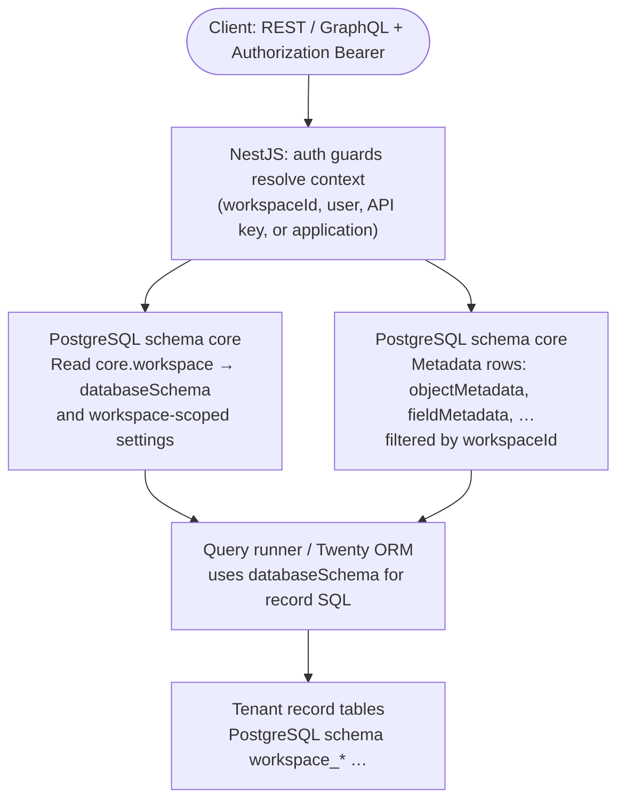
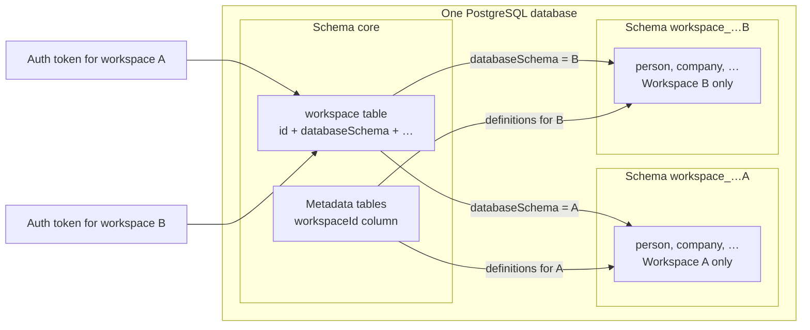

# Workspaces and PostgreSQL schemas in Twenty

This document describes how **workspaces** (tenants) map to **PostgreSQL schemas** and where different kinds of data live in the server codebase.

## Concepts

| Concept | Meaning |
|--------|---------|
| **Workspace** | A tenant: one CRM environment with its own users, roles, data model, and record data. Represented by `WorkspaceEntity` (`core.workspace`). |
| **`workspaceId`** | UUID that identifies a workspace everywhere in the app and in metadata rows. |
| **`databaseSchema`** | PostgreSQL schema name used for that workspace’s **record tables** (people, companies, custom objects, etc.). Stored on `core.workspace.databaseSchema`. |

## PostgreSQL layout (one database, multiple schemas)

Twenty typically uses **one PostgreSQL database** (URL from `PG_DATABASE_URL`) and splits data by **schema**.

### 1. `core` schema — platform + data model definitions

The main TypeORM connection is configured with **default schema `core`**:

- File: `packages/twenty-server/src/database/typeorm/core/core.datasource.ts` (`schema: 'core'`).

That connection loads entities from:

- `engine/core-modules/**/*.entity.ts` — users, workspaces, API keys, files, billing (if enabled), `keyValuePair`, etc.
- `engine/metadata-modules/**/*.entity.ts` — **object/field/view/role definitions** and other model metadata.

Those tables are created under the **`core`** schema (for example `core.workspace`, `core.objectMetadata`, `core.fieldMetadata`). The word **“metadata”** in the product often means “definitions of objects and fields,” not a separate PostgreSQL schema named `metadata`.

### 2. `workspace_<…>` schema — one schema per workspace for **records**

Each workspace gets its **own PostgreSQL schema** for **CRM rows** (standard and custom objects).

- **Name:** `workspace_` + base36 encoding of the workspace UUID.  
- Helper: `getWorkspaceSchemaName` in  
  `packages/twenty-server/src/engine/workspace-datasource/utils/get-workspace-schema-name.util.ts`

Example: workspace `a1b2c3d4-…` might use schema `workspace_<base36>` (exact string is in `core.workspace.databaseSchema`).

- **Creation:** `WorkspaceDataSourceService.createWorkspaceDBSchema`  
  `packages/twenty-server/src/engine/workspace-datasource/workspace-datasource.service.ts`  
  runs `CREATE SCHEMA` and then `WorkspaceManagerService` persists the name on the workspace row.

Record tables (person, company, opportunities, etc.) are created and migrated inside that schema by the workspace migration / Twenty ORM pipeline, driven by metadata rows keyed by `workspaceId`.

### 3. `public` schema

`packages/twenty-server/src/database/scripts/setup-db.ts` ensures `public` exists. Usage depends on deployment; **`core` and per-workspace schemas are the important ones** for understanding the product.

## How a request is scoped to a workspace

1. Authentication resolves a **user**, **API key**, or **application** context tied to a **workspace**.
2. Server code loads `WorkspaceEntity` (including `databaseSchema`) and runs queries in the correct **workspace schema** for record CRUD.
3. **Definitions** (which objects and fields exist) are read from **`core`** tables filtered by **`workspaceId`** (and related application ids where applicable).

So: **one row in `core.workspace`**, one **`databaseSchema`** for physical record storage, many **metadata rows in `core`** keyed by **`workspaceId`**.

### Mermaid: API call → workspace → isolated data

High-level path for a typical **record** or **metadata-aware** API call (REST `/rest/...`, GraphQL `/graphql`, etc.):



- **Isolation:** Record rows for workspace A live only under A’s `workspace_*` schema. Workspace B never reads A’s schema; the server picks the schema from **the authenticated workspace**, not from client-supplied schema names.
- **Definitions vs rows:** What objects and fields exist is in **`core`** (metadata tables, `workspaceId` column). Actual **people / companies / …** rows are in the **dedicated `workspace_*` schema** named on `core.workspace.databaseSchema`.

### Mermaid: why tenants do not see each other’s rows



The token (or session) determines **which workspace row** applies, hence **which `workspace_*` schema** is used for record queries. There is no shared “all tenants” table for CRM records at the SQL level.

## Related documentation and code

| Topic | Location |
|--------|-----------|
| Instance vs workspace migrations | `packages/twenty-server/docs/UPGRADE_COMMANDS.md` |
| Workspace row + `databaseSchema` | `packages/twenty-server/src/engine/core-modules/workspace/workspace.entity.ts` |
| Creating / dropping workspace DB schema | `packages/twenty-server/src/engine/workspace-datasource/workspace-datasource.service.ts` |
| Workspace bootstrap (schema + standard app) | `packages/twenty-server/src/engine/workspace-manager/workspace-manager.service.ts` |
| DDL lock during upgrades | `WORKSPACE_SCHEMA_DDL_LOCKED` in `TwentyConfigService` / config variables |

## Inspecting your instance

In `psql` (or any SQL client), after connecting to the app database:

```sql
-- All non-system schemas
SELECT schema_name FROM information_schema.schemata
  WHERE schema_name NOT IN ('pg_catalog', 'information_schema')
  ORDER BY 1;

-- Platform + model definition tables
\dt core.*

-- Pick one workspace schema from core.workspace, then:
\dt "workspace_…".*
```

Replace `"workspace_…"` with the value of `databaseSchema` from `core.workspace` for the tenant you care about.

## Summary

- **`core`**: shared **platform** tables + **metadata** tables (objects, fields, views, roles, …), keyed by **`workspaceId`** where needed.
- **`workspace_<base36(uuid)>`**: **per-tenant record data**; name stored on **`core.workspace.databaseSchema`**.
- **Workspace** = logical tenant; **schema** = physical partition for that tenant’s **rows**; **metadata** (in the product sense) mostly lives in **`core`** as rows, not in the tenant record schema.
